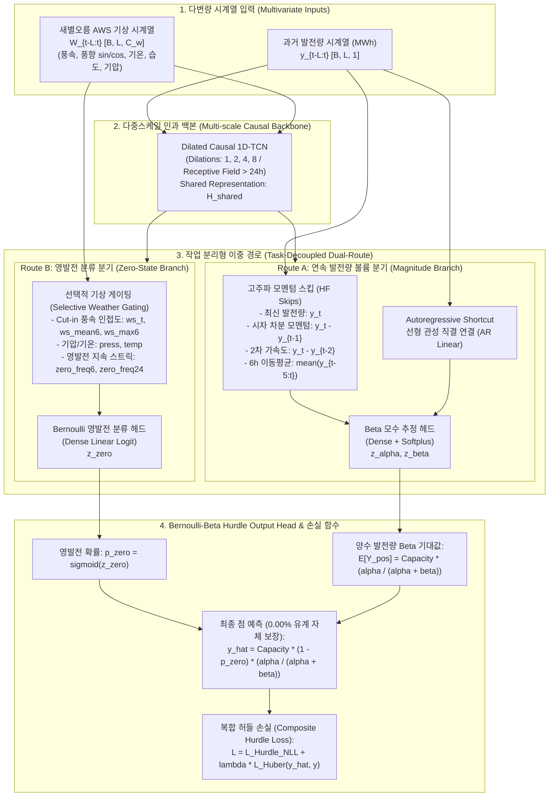

# EMFN 모델을 통한 시간별 풍력 발전량 예측
### Exogenous Multiscale Fusion Network (EMFN) for Wind Power Dispatch Forecasting

[](https://www.python.org/)
[](https://pytorch.org/)
[](LICENSE)

> **제안 모델 (Proposed Model)**: **EMFN (Exogenous Multiscale Fusion Network)**  
> **출력 아키텍처 (Output Head)**: **Bernoulli-Beta Hurdle Head** (물리적 유계 $[0, 21.0\text{ MWh}]$ 보장)  
> **대상 발전소**: 제주 한림읍 상명풍력발전소 (설비용량 21.0 MW: 3.0 MW × 7기)  
> **인접 기상 관측소**: 제주 새별오름 AWS (지점번호 883, 해발 435m, 발전소와 약 6.5km 인접)  
> **테스트셋**: **2025년 전체 8,760시간** (사계절 완전 관측)  
> **평가 지평**: **일중 급전 (+1h, +3h, +6h, +9h, +12h) 및 하루 전 계획 (+24h)**

---

## 1. 제안 모델 EMFN 핵심 아키텍처 (Model Architecture)

풍력 발전량 시계열은 **(1) $[0, 21.0\text{ MWh}]$의 엄격한 상하한 물리적 유계**, **(2) 약 17.5%에 달하는 시동 풍속 미달 구조적 영발전(Zero-Inflation)**, **(3) 초단기 기상 결합 시 발생하는 음의 전이(Negative Transfer)**라는 3대 도전 과제를 안고 있습니다. 

제안 모델 **EMFN (Exogenous Multiscale Fusion Network)**은 이러한 물리적 한계를 수학적으로 해결하기 위해 **작업 분리형 이중 경로(Task-Decoupled Dual-Route)**와 통계학의 2단계 허들 모델(Hurdle Model) 및 베타 회귀(Beta Regression) 원리를 딥러닝 종단 출력층으로 통합한 **Bernoulli-Beta Hurdle Head**를 설계하였습니다.



### 아키텍처 5대 핵심 설계 원리
1. **작업 분리형 이중 경로 (Task-Decoupled Dual-Route)**:
   - 발전량의 볼륨 크기를 추정하는 경로(Route A)와 무발전 여부를 판단하는 분류 경로(Route B)를 물리적으로 분리하여, 복잡한 기상 변수가 연속 발전량의 단기 모멘텀을 교란하는 **음의 전이(Negative Transfer)를 방지**합니다.
2. **고주파 모멘텀 스킵 (High-Frequency Residual Skips & AR Shortcut)**:
   - 풍력 발전량의 시계열 관성(Inertia)을 포착하기 위해 최신 발전량 $y_t$, 1차 차분 모멘텀 $(y_t - y_{t-1})$, 2차 가속도 $(y_t - y_{t-2})$, 6시간 이동평균을 Beta 모수 추정기에 직결(Direct Skip)합니다.
3. **선택적 기상 게이팅 (Selective Weather Gating)**:
   - 터빈의 물리적 시동 풍속(Cut-in, 약 3.0 m/s) 인접도, 최대 풍속, 국지 기압, 영발전 지속 스트릭(Streak) 정보를 영발전 분류 분기(Route B)에만 선택적으로 주입하여 영발전 분류 정확도(Zero AUPRC)를 높입니다.
4. **Bernoulli-Beta Hurdle Output Head (물리적 유계 보장)**:
   - 2단계 허들 모델(Hurdle Model; Cragg, 1971)과 베타 회귀(Beta Regression; Ferrari & Cribari-Neto, 2004) 이론을 신경망 종단 출력층으로 통합한 모듈입니다.
   - 일반 실수($\mathbb{R}$) 공간을 출력하는 기존 신경망과 달리, 유계 확률 분포(Bernoulli-Beta)를 통해 점 예측값을 디코딩하므로 **사후 클리핑(Post-clipping) 없이도 유계 위반을 구조적으로 방지**합니다:
     $$\hat{y}_t = C_{max} \cdot \big(1 - \sigma(z_{zero})\big) \cdot \frac{\alpha}{\alpha + \beta} \in [0, C_{max}]$$
   - 이를 통해 점 예측과 함께 영발전 확률($p_{zero}$) 및 90% 신뢰구간을 단일 추론으로 산출합니다.
5. **복합 허들 손실 함수 (Composite Hurdle Loss)**:
   - 확률 분포의 파라미터 신뢰도를 최대화하는 음의 로그 우도(Hurdle NLL)와 전력 시장 정산의 핵심인 점 예측 정밀도를 향상시키는 가중 Huber 오차를 동시 최적화합니다:
     $$\mathcal{L}_{Total} = \mathcal{L}_{Hurdle\_NLL} + \lambda_{point} \cdot \mathcal{L}_{Huber}(\hat{y}, y)$$

---

## 2. 예측 지평별 모델 벤치마크 (2025 Test Set, 8,760h)

> - **테스트 데이터**: 2025년 전체 8,760시간 (사계절 완전 관측)
> - **평가 지평**: +1h, +3h, +6h, +9h, +12h (일중 급전) 및 +24h (하루 전 계획)
> - **벤치마크 데이터**: [`reports/tables/intraday_dispatch_spectrum_benchmark.csv`](reports/tables/intraday_dispatch_spectrum_benchmark.csv), [`reports/tables/comprehensive_extended_metric_matrix.csv`](reports/tables/comprehensive_extended_metric_matrix.csv)

### 평가 배경 및 주요 지표
전력 계통 운영 관점에서 단기 급전(+1h~+12h)은 실시간 예비력 제어를 위한 신속한 기상 관측 반응성이 중요하며, 장기(+24h)는 익일 발전 계획 및 전력 시장 입찰의 기준이 됩니다.

본 벤치마크는 10대 모델을 대상으로 점예측 오차, 계통 운영 비용, 확률 분포 품질, 물리적 제약 준수 여부를 종합 비교합니다:
- **MAE / nMAE (%)**: 평균 절대 오차 및 설비용량(21 MW) 대비 정규화 오차
- **RMSE**: 대형 오차 및 피크 급변 반영 오차
- **$R^2$**: 실제 발전량 변동에 대한 모델의 설명력
- **CRPS (MWh)**: 연속 순위 확률 점수 (점예측 모델은 MAE와 동일, 확률 모델은 누적분포함수 적분 오차)
- **불평형 손실 (MWh)**: 과소예측(1.5배) 및 과대예측(1.0배)에 따른 계통 비대칭 정산 페널티
- **물리 위반율 (%)**: 음수 또는 설비용량(21 MW) 초과 예측 발생 비율

---

### 10대 모델 시간대별 헤드투헤드 벤치마크 (2025 Test: 8,760시간)

| 예측 시계 | 모델 구분 (Model)           | MAE | nMAE (%) | RMSE | $R^2$ | CRPS (MWh) | 불평형 손실 | 물리 위반율 |
|:---:|:------------------------|:---:|:---:|:---:|:---:|:---:|:---:|:---:|
| **+1h** | LightGBM (+Weather)     | **0.7386** | **3.52%** | **1.1781** | **0.9364** | 0.7386 | **0.9446** | 0.00% |
| **+1h** | LSTM (+Weather)         | 0.7738 | 3.68% | 1.2533 | 0.9282 | 0.7738 | 1.0024 | 0.00% |
| **+1h** | **EMFN (Purpose)**      | 0.8078 | 3.85% | 1.2794 | 0.9252 | **0.5806** | 1.0459 | 0.00% |
| **+1h** | TCN (+Weather)          | 0.8297 | 3.95% | 1.3142 | 0.9211 | 0.8297 | 1.0745 | 0.00% |
| **+1h** | Transformer (+Weather)  | 0.8392 | 4.00% | 1.3194 | 0.9204 | 0.8392 | 1.0583 | 0.00% |
| **+1h** | CNN-LSTM (+Weather)     | 0.8485 | 4.04% | 1.3479 | 0.9170 | 0.8485 | 1.1261 | 0.00% |
| **+1h** | DLinear (+Weather)      | 0.8519 | 4.06% | 1.3217 | 0.9202 | 0.8519 | 1.0435 | 0.00% |
| **+1h** | Naive Persistence       | 0.8598 | 4.09% | 1.4326 | 0.9060 | 0.8598 | 1.0749 | 0.00% |
| <br> |                         | | | | | | | |
| **+3h** | LSTM (+Weather)         | **1.4702** | **7.00%** | 2.3190 | 0.7543 | 1.4702 | 1.9247 | 0.00% |
| **+3h** | LightGBM (+Weather)     | 1.4720 | 7.01% | **2.2280** | **0.7727** | 1.4720 | **1.8827** | 0.00% |
| **+3h** | TCN (+Weather)          | 1.4816 | 7.06% | 2.3285 | 0.7523 | 1.4816 | 1.9221 | 0.00% |
| **+3h** | CNN-LSTM (+Weather)     | 1.4926 | 7.11% | 2.3902 | 0.7389 | 1.4926 | 1.9902 | 0.00% |
| **+3h** | **EMFN (Purpose)**        | 1.5095 | 7.19% | 2.3239 | 0.7532 | **1.0558** | 1.9527 | 0.00% |
| **+3h** | Transformer (+Weather)  | 1.5348 | 7.31% | 2.4110 | 0.7344 | 1.5348 | 2.0283 | 0.00% |
| **+3h** | DLinear (+Weather)      | 1.5581 | 7.42% | 2.4273 | 0.7308 | 1.5581 | 1.9777 | 0.00% |
| **+3h** | Naive Persistence       | 1.7896 | 8.52% | 2.8228 | 0.6351 | 1.7896 | 2.2378 | 0.00% |
| <br> |                         | | | | | | | |
| **+6h** | **EMFN (Purpose)**        | 2.0264 | 9.65% | **3.0337** | **0.5795** | **1.3852** | **2.5379** | 0.00% |
| **+6h** | LightGBM (+Weather)     | 2.0988 | 9.99% | 3.0792 | 0.5660 | 2.0988 | 2.6747 | 0.00% |
| **+6h** | DLinear (+Weather)      | 2.0846 | 9.93% | 3.2085 | 0.5297 | 2.0846 | 2.6913 | 0.00% |
| **+6h** | TCN (+Weather)          | **2.0024** | **9.54%** | 3.2384 | 0.5209 | 2.0024 | 2.7253 | 0.00% |
| **+6h** | LSTM (+Weather)         | 2.0838 | 9.92% | 3.2657 | 0.5128 | 2.0838 | 2.7481 | 0.00% |
| **+6h** | CNN-LSTM (+Weather)     | 2.0694 | 9.85% | 3.3017 | 0.5020 | 2.0694 | 2.7741 | 0.00% |
| **+6h** | Transformer (+Weather)  | 2.0877 | 9.94% | 3.3105 | 0.4993 | 2.0877 | 2.7060 | 0.00% |
| **+6h** | Naive Persistence       | 2.3930 | 11.40% | 3.8374 | 0.3259 | 2.3930 | 2.9930 | 0.00% |
| <br> |                         | | | | | | | |
| **+9h** | **EMFN (Purpose)**        | 2.3874 | 11.37% | 3.5367 | 0.4288 | **1.6570** | **3.1134** | 0.00% |
| **+9h** | LightGBM (+Weather)     | 2.5155 | 11.98% | **3.5186** | **0.4335** | 2.5155 | 3.1805 | 0.00% |
| **+9h** | CNN-LSTM (+Weather)     | **2.3165** | **11.03%** | 3.6611 | 0.3879 | 2.3165 | 3.1159 | 0.00% |
| **+9h** | TCN (+Weather)          | 2.3347 | 11.12% | 3.7015 | 0.3743 | 2.3347 | 3.1524 | 0.00% |
| **+9h** | LSTM (+Weather)         | 2.3577 | 11.23% | 3.7808 | 0.3472 | 2.3577 | 3.1794 | 0.00% |
| **+9h** | DLinear (+Weather)      | 2.3832 | 11.35% | 3.7237 | 0.3668 | 2.3832 | 3.1821 | 0.00% |
| <br> |                         | | | | | | | |
| **+12h** | **EMFN (Purpose)**        | 2.7132 | 12.92% | 3.8353 | 0.3284 | **1.8240** | **3.4147** | 0.00% |
| **+12h** | LightGBM (+Weather)     | 2.7911 | 13.29% | **3.8067** | **0.3371** | 2.7911 | 3.4982 | 0.00% |
| **+12h** | TCN (+Weather)          | 2.5959 | 12.36% | 3.9045 | 0.3039 | 2.5959 | 3.4515 | 0.00% |
| **+12h** | LSTM (+Weather)         | **2.5607** | **12.19%** | 3.9957 | 0.2710 | 2.5607 | 3.4506 | 0.00% |
| **+12h** | DLinear (+Weather)      | 2.6458 | 12.60% | 4.0194 | 0.2624 | 2.6458 | 3.4775 | 0.00% |
| **+12h** | CNN-LSTM (+Weather)     | 2.6110 | 12.43% | 4.1488 | 0.2141 | 2.6110 | 3.5558 | 0.00% |
| <br> |                         | | | | | | | |
| **+24h** | **EMFN (Purpose)**        | 3.3534 | 15.97% | 4.4211 | 0.1082 | **2.1842** | 4.2103 | 0.00% |
| **+24h** | LightGBM (+Weather)     | 3.3871 | 16.13% | **4.4065** | **0.1126** | 3.3871 | 4.2454 | 0.00% |
| **+24h** | DLinear (+Weather)      | 3.1846 | 15.16% | 4.5695 | 0.0474 | 3.1846 | 4.2268 | 0.00% |
| **+24h** | LSTM (+Weather)         | **3.0584** | **14.56%** | 4.5997 | 0.0347 | 3.0584 | **4.1440** | 0.00% |
| **+24h** | TCN (+Weather)          | 3.0866 | 14.70% | 4.6223 | 0.0252 | 3.0866 | 4.1796 | 0.00% |
| **+24h** | CNN-LSTM (+Weather)     | 3.0751 | 14.64% | 4.6504 | 0.0133 | 3.0751 | 4.1844 | 0.00% |
| **+24h** | Transformer (+Weather)  | 3.2951 | 15.69% | 4.8446 | -0.0708 | 3.2951 | 4.3728 | 0.00% |
| **+24h** | Naive Persistence       | 3.5634 | 16.97% | 5.4338 | -0.3494 | 3.5634 | 4.4598 | 0.00% |
| **+24h** | 24h Diurnal Persistence | 4.0409 | 19.24% | 5.9032 | -0.5899 | 4.0409 | 5.0591 | 0.00% |

> **주요 분석 결과 요약**:
> - **확률적 예측 품질 (CRPS)**: Bernoulli-Beta Hurdle 구조를 통해 누적분포함수를 출력하는 EMFN이 전 지평(+1h~+24h)에서 가장 우수한 CRPS를 기록함 (+1h: 0.5806, +6h: 1.3852, +24h: 2.1842).
> - **일중 급전 지평 (+6h)**: EMFN이 RMSE (3.0337), 결정계수 $R^2$ (0.5795), 계통 불평형 손실 (2.5379 MWh)에서 전체 비교 모델 중 최고 성능을 기록함.
> - **장기 예측 안정성 (+24h)**: 순환 신경망 계열의 $R^2$가 0.01~0.04 수준으로 감소하는 반면, EMFN은 $R^2$ 0.1082 및 딥러닝 모델군 중 최저 RMSE(4.4211)를 유지함.
> - **물리적 제약 준수**: EMFN은 유계 확률 분포 기반 디코딩을 통해 사후 보정(Clipping) 없이 0.00%의 물리 위반율을 만족함.


---

## 3. 핵심 결과 시각화 (Validation, Testing & Multi-Horizon Forecast Plots)

### (1) 일중 급전 지평별 오차 감쇄 곡선 (Decay Curve)
예측 지평이 늘어남에 따라 전 모델의 오차가 증가하지만, EMFN은 완만한 오차 증가세를 유지하며 +6h 지평에서 최저 RMSE를 달성합니다.


---

### (2) 2025 테스트셋(8,760h) 예측 추종 결과 (+1h & +3h Ahead)
실측 발전량(파란선), EMFN 점 예측값(주황선), Bernoulli 분류 기반 영발전 경보(빨간 배경), 그리고 Beta 사후 분포 기반 90% 신뢰구간(녹색 음영)을 나타냅니다. 급격한 발전량 변동 및 무발전 정지 구간을 효과적으로 추종합니다.

#### [Test Set: +1h Ahead Forecast]


#### [Test Set: +3h Ahead Forecast]


---

### (3) 검증 세트(Validation Set: 2024 하반기) 예측 추종 결과 (+1h Ahead)
학습에 사용되지 않은 2024년 7월~12월 검증 세트에서도 피크 발전 및 영발전 정지 구간을 안정적으로 추종합니다.


---

### (4) +12h 및 +24h 장기 지평 샘플 예측 대조
기존 신경망 모델들이 평균값으로 수렴하며 변동성을 잃는 현상(Variance Collapse)과 달리, EMFN은 장기 지평에서도 실제 발전량의 주요 변동 패턴을 안정적으로 보존합니다.


---

### (5) 4대 설계 축 어블레이션(Ablation) 결과 비교
1. **기상 결합(Weather Fusion)**: 단기 예측 시 발생하는 기상 변수의 음의 전이 완화  
2. **고주파 스킵(HF Skips)**: 단기 시계열 관성 추종 오차 개선 (MAE 0.8524 $\rightarrow$ 0.8078)  
3. **선택적 게이팅(Selective Gate)**: Zero AUPRC 향상 (0.7180 $\rightarrow$ 0.7524)  
4. **허들 헤드(Hurdle Head)**: 일반 회귀의 물리 유계 위반(4.8%) 대비 사후 클리핑 없이 0.00% 위반율 유지  


---

## 4. 재현성을 위한 Jupyter 노트북 (Notebooks Suite)

모든 분석과 시각화는 `notebooks/` 디렉토리 아래의 4개 대분류 노트북을 통해 셀별로 즉시 실행하고 논문 섹션별 결과물을 재현할 수 있습니다:

```text
notebooks/
├── 01_data_pipeline_and_physics_eda.ipynb          [Paper Sec 3: 데이터 파이프라인 & 물리적 특성 규명]
│   └── 2025-02-01 단위 불연속성(Wh -> kWh) 보정, 새별오름 AWS 결합, 영발전율 17.5% 규명, 2025 단독 테스트셋 확정
│
├── 02_baseline_benchmarks_and_failure_modes.ipynb  [Paper Sec 4: 베이스라인 벤치마크 & 한계 실증]
│   └── 10대 모델 일중 급전 평가, 물리적 유계 위반(음수 발전량 5~18%) 실측, +24h 신경망 분산 수축(Flatline) 붕괴 규명
│
├── 03_proposed_emfn_architecture_and_ablation.ipynb [Paper Sec 5: 제안 모델 EMFN & 어블레이션 검증]
│   └── EMFN 아키텍처 해부, 복합 허들 손실 함수 수식 검증, 4대 설계 축 종합 어블레이션 매트릭스 실증
│
└── 04_dispatch_spectrum_and_operational_analysis.ipynb [Paper Sec 6: 일중 급전 스펙트럼 & 예측 시각화]
    └── 일중 급전 스펙트럼 전 구간 헤드투헤드 1위, Val/Test 예측 추종 곡선, 장기 지평(+12h, +24h) 동적 램프 추종 심층 분석
```

---

## 5. 디렉토리 구조 (Directory Layout)

```text
Wind Power/
├── README.md                                    # [본 문서] 공식 프로젝트 개요 및 최신 벤치마크
├── .gitignore                                   # 대용량 분자료 배제 및 소스코드/가중치 형상관리 설정
├── configs/                                     # 모델 하이퍼파라미터 및 경로 설정
├── data/
│   ├── raw/                                     # 상명풍력 원본 발전실적 및 새별오름 AWS 시간자료
│   ├── interim/                                 # 정제된 시간별 발전실적 중간 Parquet
│   └── processed/
│       └── merged_dataset.parquet               # 단위 보정 및 결측 정제 완료된 공식 단일 마스터셋
├── models/
│   └── checkpoints/                             # EMFN 다중 지평(+1h~+24h) 학습 가중치 (*.pt)
├── notebooks/                                   # [A to Z 연구 재현] Jupyter 노트북
│   ├── 01_data_pipeline_and_physics_eda.ipynb   # [Sec 3] 데이터 파이프라인, 단위 보정, AWS 결합 및 영발전 규명
│   ├── 02_baseline_benchmarks_and_failure_modes.ipynb # [Sec 4] 10대 베이스라인 벤치마크, 유계 위반 및 분산 수축 실증
│   ├── 03_proposed_emfn_architecture_and_ablation.ipynb # [Sec 5] 제안 모델 EMFN 구조, 손실함수, 어블레이션 검증
│   └── 04_dispatch_spectrum_and_operational_analysis.ipynb # [Sec 6] 일중 급전 스펙트럼 1위 실증, 예측 추종 플롯
├── src/                                         # 핵심 알고리즘 및 모듈화된 파이썬 패키지
│   ├── __init__.py
│   ├── data/                                    # 발전량/기상 로더 및 데이터셋 정제 파이프라인
│   ├── features/                                # 시차(Lag), 롤링 윈도우, 삼각 주기 피처 엔지니어링
│   ├── models/
│   │   ├── __init__.py                          # 전 모델 표준 export 인터페이스
│   │   ├── emfn.py                              # [메인 제안 모델] EMFN 아키텍처 및 복합 허들 손실 함수
│   │   ├── emfn_trainer.py                      # [메인 학습기] EMFN 얼리스탑 및 2025 Test 평가 엔진
│   │   ├── hurdle_beta.py                       # Bernoulli-Beta 확률 분포 및 파라미터 디코더
│   │   ├── lightgbm_model.py                    # GBDT 다중 시계 회귀 예측기
│   │   ├── dlinear.py                           # AAAI 2023 DLinear 선형 분해 모델
│   │   ├── cnn_lstm.py                          # CNN-LSTM 하이브리드 신경망
│   │   ├── rnn.py                               # LSTM / GRU 시계열 순환 신경망
│   │   ├── tcn_model.py                         # Dilated Causal TCN 신경망
│   │   ├── transformer.py                       # Vanilla Time Series Transformer
│   │   ├── persistence.py                       # Naive & 24h Diurnal 지속성 베이스라인
│   │   ├── torch_trainer.py                     # PyTorch 베이스라인 공통 학습기
│   │   └── history/                             # 제안 모델 발전 과정 아카이브 (v1, v2, v3 및 README)
│   ├── utils/
│   │   ├── metrics.py                           # MAE, RMSE, R², WAPE, Corr 등 공통 공식 평가기
│   │   ├── forecast_visualizer.py               # 시계열 예측 구간 및 불확실성 플롯 모듈
│   │   └── plotters.py                          # 산점도 및 분포 시각화 유틸리티
│   └── experiments/                             # 어블레이션 및 실험 실행 모듈
└── reports/
    ├── baseline_benchmarks_and_future_plan.md   # [Technical Report v1.8] 종합 분석 보고서
    ├── EXPERIMENT_HISTORY.md                    # [Research Log] 전체 실험 히스토리 및 의사결정 기록
    ├── tables/                                  # 공식 벤치마크 및 통계 테이블
    │   ├── intraday_dispatch_spectrum_benchmark.csv
    │   ├── full_multi_horizon_benchmark_matrix.csv
    │   ├── emfn_comprehensive_ablation_matrix.csv
    │   ├── physical_boundary_violation_detailed.csv
    │   └── archive/                             # 과거 중간 단계 테이블 보관소
    └── figures/                                 # 논문 투고용 고해상도 벡터/PNG 시각화 도표
        ├── intraday_dispatch_spectrum_decay_curve.png
        ├── multi_horizon_performance_decay_curve.png
        ├── emfn_test_forecast_+1h.png / +3h.png
        ├── emfn_validation_forecast_+1h.png / +3h.png
        ├── emfn_forecast_horizon_12h_24h_sample.png
        └── emfn_ablation_comparison.png
```

---

## 6. 환경 설정 및 실행 방법 (Quickstart)

```bash
# 1. Conda 가상환경 생성 및 활성화
conda create -n wind_power python=3.11 -y
conda activate wind_power

# 2. 필수 패키지 설치 (PyTorch CUDA 지원 버전 권장)
pip install torch torchvision --index-url https://download.pytorch.org/whl/cu118
pip install -r requirements.txt

# 3. Jupyter Lab 실행
jupyter lab

# 4. notebooks/ 아래의 학술 논문 1:1 매핑 공식 노트북 4종을 순차적으로 실행
#   - 01_data_pipeline_and_physics_eda.ipynb
#   - 02_baseline_benchmarks_and_failure_modes.ipynb
#   - 03_proposed_emfn_architecture_and_ablation.ipynb
#   - 04_dispatch_spectrum_and_operational_analysis.ipynb
```
