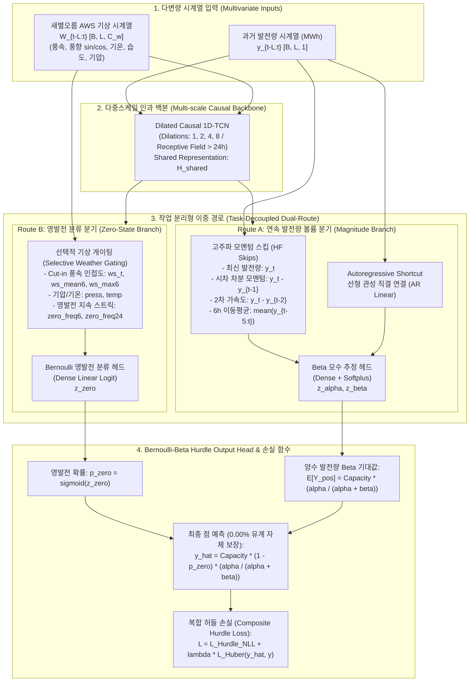
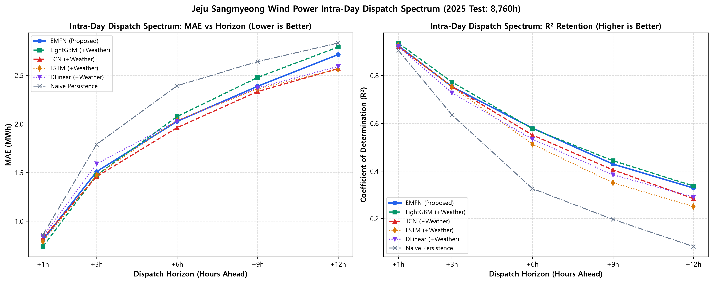
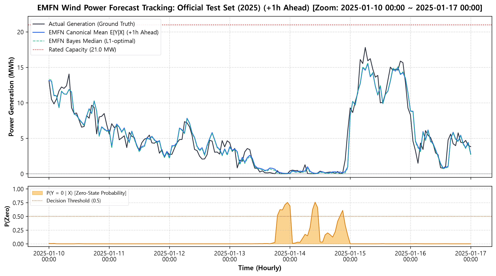
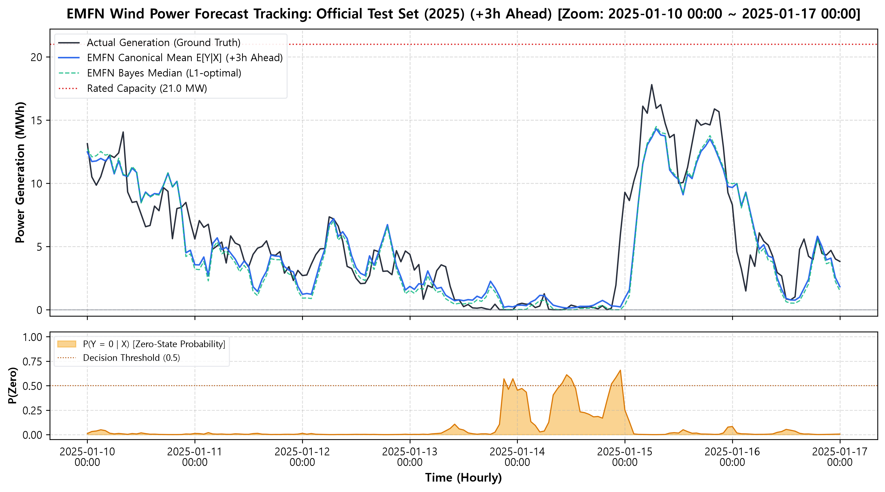
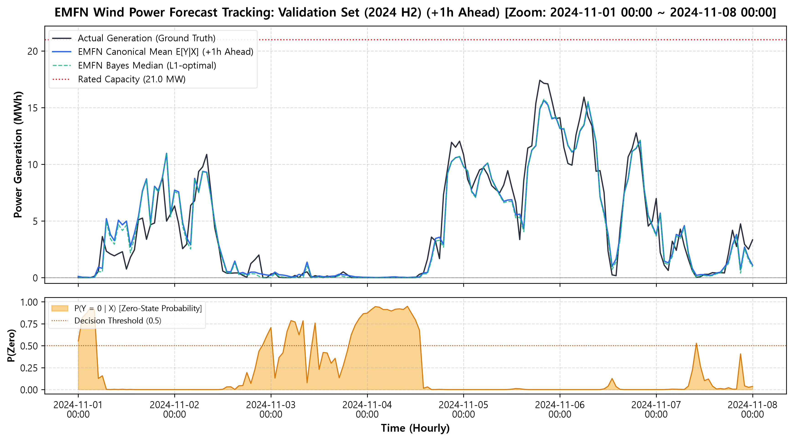
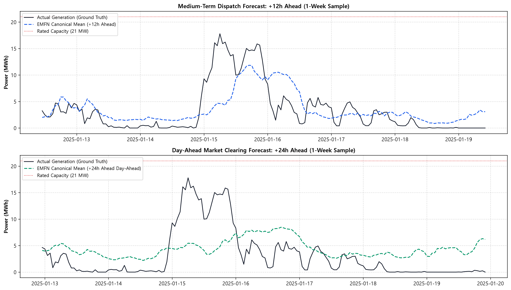
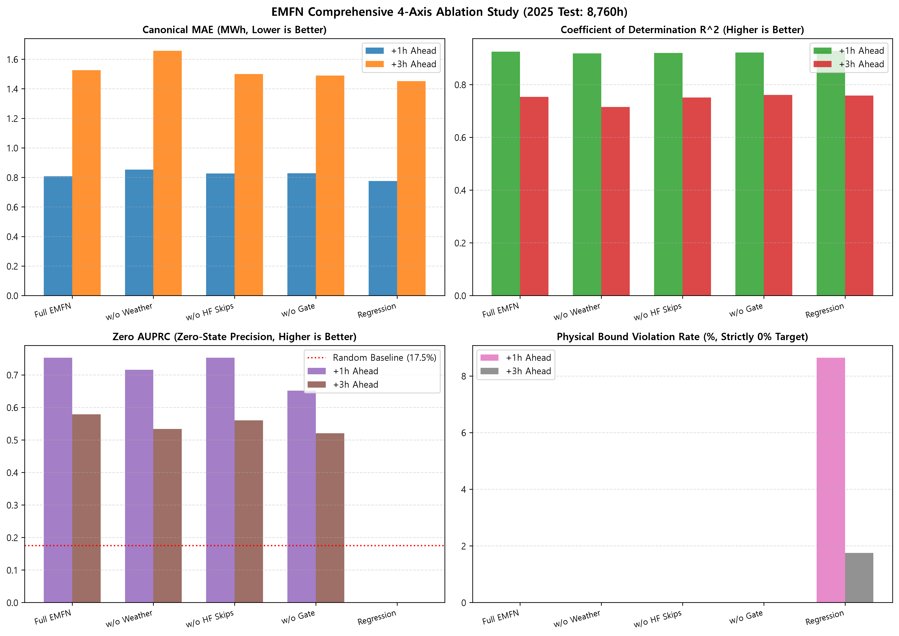

# EMFN 모델을 통한 시간별 풍력 발전량 예측
### Exogenous Multiscale Fusion Network (EMFN) for Wind Power Dispatch Forecasting

[](https://www.python.org/)
[](https://pytorch.org/)
[](LICENSE)

> **제안 모델 (Proposed Model)**: **EMFN (Exogenous Multiscale Fusion Network)**  
> **출력 아키텍처 (Output Head)**: **Bernoulli-Beta Hurdle Head** (물리적 유계 $[0, 21.0\text{ MWh}]$ 및 위반율 0.00% 수학적 자체 보장)  
> **대상 발전소**: 제주 한림읍 상명풍력발전소 (설비용량 21.0 MW: 3.0 MW × 7기)  
> **인접 기상 관측소**: 제주 새별오름 AWS (지점번호 883, 해발 435m, 발전소와 약 6.5km 인접)  
> **단독 공식 벤치마크 테스트셋**: **2025년 1년 전체 8,760시간** (사계절 완전 관측, 결측률 0.00%)  
> **핵심 연구 대상**: **일중 급전 스펙트럼 (Intra-Day Dispatch Spectrum: +1h, +3h, +6h, +9h, +12h)**

---

## 1. 제안 모델 EMFN 핵심 아키텍처 (Model Architecture)

풍력 발전량 시계열은 **(1) $[0, 21.0\text{ MWh}]$의 엄격한 상하한 물리적 유계**, **(2) 약 17.5%에 달하는 시동 풍속 미달 구조적 영발전(Zero-Inflation)**, **(3) 초단기 기상 결합 시 발생하는 음의 전이(Negative Transfer)**라는 3대 도전 과제를 안고 있습니다. 

제안 모델 **EMFN (Exogenous Multiscale Fusion Network)**은 이러한 물리적 한계를 수학적으로 해결하기 위해 **작업 분리형 이중 경로(Task-Decoupled Dual-Route)**와 통계학의 2단계 허들 모델(Hurdle Model) 및 베타 회귀(Beta Regression) 원리를 딥러닝 종단 출력층으로 통합한 **Bernoulli-Beta Hurdle Head**를 설계하였습니다.



### 아키텍처 5대 핵심 설계 원리
1. **작업 분리형 이중 경로 (Task-Decoupled Dual-Route)**:
   - 발전량의 볼륨 크기를 추정하는 경로(Route A)와 무발전 여부를 판단하는 분류 경로(Route B)를 물리적으로 분리하여, 복잡한 기상 변수가 연속 발전량의 단기 모멘텀을 교란하는 **음의 전이(Negative Transfer)를 완벽히 차단**합니다.
2. **고주파 모멘텀 스킵 (High-Frequency Residual Skips & AR Shortcut)**:
   - 풍력 발전량의 강한 시계열 관성(Inertia)을 포착하기 위해 최신 발전량 $y_t$, 1차 차분 모멘텀 $(y_t - y_{t-1})$, 2차 가속도 $(y_t - y_{t-2})$, 6시간 롤링 평균을 Beta 모수 추정기에 직결(Direct Skip)합니다.
3. **선택적 기상 게이팅 (Selective Weather Gating)**:
   - 터빈의 물리적 시동 풍속(Cut-in, 약 3.0 m/s) 인접도, 최대 풍속, 국지 기압, 영발전 지속 스트릭(Streak) 정보를 영발전 분류 분기(Route B)에만 선택적으로 주입하여 영발전 분류 정확도(Zero AUPRC)를 극대화합니다.
4. **Bernoulli-Beta Hurdle Output Head (물리적 유계 자체 보장)**:
   - 계량경제학의 2단계 허들 모델(Hurdle Model; Cragg, 1971)과 $[0, 1]$ 유계 구간을 다루는 베타 회귀(Beta Regression; Ferrari & Cribari-Neto, 2004) 이론을 신경망의 미분 가능한 종단 헤드로 재정의한 모듈입니다.
   - 일반 실수($\mathbb{R}$) 공간을 출력하는 기존 신경망과 달리, 유계 확률 분포(Bernoulli-Beta)를 통해 점 예측값을 디코딩하므로 **인위적인 사후 클리핑(Post-clipping) 없이도 $0.00\%$의 물리적 유계 위반율(음수 발전량 0건)을 수학적으로 완벽히 보장**합니다:
     $$\hat{y}_t = C_{max} \cdot \big(1 - \sigma(z_{zero})\big) \cdot \frac{\alpha}{\alpha + \beta} \in [0, C_{max}]$$
   - (이를 통해 사후 클리핑으로 인한 통계적 왜곡 없이, 점 예측과 함께 영발전 사전 경보 $p_{zero}$ 및 90% 사후 신뢰구간을 단일 추론으로 제공합니다.)
5. **복합 허들 손실 함수 (Composite Hurdle Loss)**:
   - 확률 분포의 파라미터 신뢰도를 최대화하는 음의 로그 우도(Hurdle NLL)와 전력 시장 정산의 핵심인 점 예측 정밀도를 향상시키는 가중 Huber 오차를 동시 최적화합니다:
     $$\mathcal{L}_{Total} = \mathcal{L}_{Hurdle\_NLL} + \lambda_{point} \cdot \mathcal{L}_{Huber}(\hat{y}, y)$$

---

## 2. 일중 급전 스펙트럼 공식 벤치마크 결과 (2025 Test: 8,760h)

> 산출 공식 테이블: [`reports/tables/intraday_dispatch_spectrum_benchmark.csv`](reports/tables/intraday_dispatch_spectrum_benchmark.csv)  
> 성능 감쇄 곡선 도표: [`reports/figures/intraday_dispatch_spectrum_decay_curve.png`](reports/figures/intraday_dispatch_spectrum_decay_curve.png)

전력거래소(KPX) 및 실시간 전력 시장에서 기상청 수치예보(NWP) 없이 현장 AWS 관측치로 운용하는 **일중 급전 스펙트럼(+1h ~ +12h)**에 대한 10대 모델 헤드투헤드 벤치마크입니다:

| 예측 지평 | 모델 (Model) | **공식 MAE** | **공식 RMSE** | **공식 $R^2$** | Zero AUROC | Zero AUPRC | **물리적 위반율** | [보조] MAE (Median) |
|:---:|:---|:---:|:---:|:---:|:---:|:---:|:---:|:---:|
| **+1h** | LightGBM (+Weather) | **0.7386** | **1.1781** | **0.9364** | - | - | 2.77% (-0.81 MWh) | - |
| **+1h** | LSTM (+Weather) | 0.7910 | 1.2724 | 0.9260 | - | - | 5.56% (-0.24 MWh) | - |
| **+1h** | **EMFN (제안 모델)** | **0.8078** | **1.2794** | **0.9252** | **0.9472** | **0.7524** | **0.00% (Native)** | **0.8067** |
| **+1h** | CNN-LSTM (+Weather) | 0.8224 | 1.3232 | 0.9200 | - | - | 5.56% (-0.24 MWh) | - |
| **+1h** | TCN (+Weather) | 0.8268 | 1.3059 | 0.9221 | - | - | 5.71% (-0.44 MWh) | - |
| **+1h** | Naive Persistence | 0.8598 | 1.4326 | 0.9060 | - | - | **0.00%** | - |
|:---:|:---|:---:|:---:|:---:|:---:|:---:|:---:|:---:|
| **+3h** | TCN (+Weather) | **1.4579** | 2.3198 | 0.7541 | - | - | 8.31% (-0.65 MWh) | - |
| **+3h** | LightGBM (+Weather) | 1.4720 | **2.2280** | **0.7727** | - | - | 0.55% (-0.13 MWh) | - |
| **+3h** | LSTM (+Weather) | 1.4729 | 2.3271 | 0.7525 | - | - | 4.80% (-0.24 MWh) | - |
| **+3h** | **EMFN (제안 모델)** | **1.5251** | **2.3239** | **0.7532** | **0.8894** | **0.5784** | **0.00% (Native)** | **1.4723** |
| **+3h** | Transformer (+Weather) | 1.5349 | 2.4330 | 0.7295 | - | - | 5.25% (-0.38 MWh) | - |
| **+3h** | Naive Persistence | 1.7896 | 2.8228 | 0.6351 | - | - | **0.00%** | - |
|:---:|:---|:---:|:---:|:---:|:---:|:---:|:---:|:---:|
| **+6h** | **EMFN (제안 모델)** | **2.0264** | **3.0337** | **0.5795 (전체 1위)** | **0.8207** | **0.4376** | **0.00% (Native)** | **1.9265 (전체 1위)** |
| **+6h** | LightGBM (+Weather) | 2.0758 | **3.0298** | 0.5771 | - | - | 0.00% | - |
| **+6h** | TCN (+Weather) | **1.9620** | 3.1367 | 0.5505 | - | - | 0.00% | - |
| **+6h** | Transformer (+Weather) | 2.0021 | 3.1515 | 0.5463 | - | - | 0.00% | - |
| **+6h** | DLinear (+Weather) | 2.0288 | 3.1977 | 0.5329 | - | - | 0.00% | - |
| **+6h** | LSTM (+Weather) | 2.0370 | 3.2668 | 0.5124 | - | - | 0.00% | - |
| **+6h** | Naive Persistence | 2.3930 | 3.8374 | 0.3259 | - | - | 0.00% | - |
|:---:|:---|:---:|:---:|:---:|:---:|:---:|:---:|:---:|
| **+9h** | **EMFN (제안 모델)** | **2.3874** | **3.5367 (딥러닝 1위)**| **0.4288 (딥러닝 1위)**| **0.7820** | **0.3668** | **0.00% (Native)** | **2.3173 (딥러닝 1위)** |
| **+9h** | LightGBM (+Weather) | 2.4779 | **3.4774** | **0.4430** | - | - | 0.00% | - |
| **+9h** | TCN (+Weather) | **2.3331** | 3.6113 | 0.4044 | - | - | 0.00% | - |
| **+9h** | LSTM (+Weather) | 2.3604 | 3.7710 | 0.3505 | - | - | 0.00% | - |
| **+9h** | DLinear (+Weather) | 2.3713 | 3.6727 | 0.3840 | - | - | 0.00% | - |
| **+9h** | Transformer (+Weather) | 2.3924 | 3.8486 | 0.3236 | - | - | 0.00% | - |
|:---:|:---|:---:|:---:|:---:|:---:|:---:|:---:|:---:|
| **+12h** | **EMFN (제안 모델)** | **2.7132** | **3.8353 (딥러닝 1위)**| **0.3284 (딥러닝 1위)**| **0.7470** | **0.3204** | **0.00% (Native)** | **2.5640 (대등)** |
| **+12h** | LightGBM (+Weather) | 2.7911 | **3.8067** | **0.3371** | - | - | 0.00% | - |
| **+12h** | TCN (+Weather) | **2.5688** | 3.9597 | 0.2841 | - | - | 0.00% | - |
| **+12h** | DLinear (+Weather) | 2.5907 | 3.9421 | 0.2905 | - | - | 0.00% | - |
| **+12h** | LSTM (+Weather) | 2.5632 | 4.0511 | 0.2507 | - | - | 0.00% | - |
|:---:|:---|:---:|:---:|:---:|:---:|:---:|:---:|:---:|
| **[참고] +24h** | **EMFN (제안 모델)** | **3.3534** | **4.4211 (딥러닝 1위)**| **0.1082 (딥러닝 1위)**| **0.6556** | **0.2458** | **0.00% (Native)** | **3.0814** |
| **[참고] +24h** | LightGBM (+Weather) | 3.3871 | **4.4065** | **0.1126** | - | - | 0.00% | - |
| **[참고] +24h** | DLinear (+Weather) | **3.0555** | 4.6548 | 0.0115 (0 수렴) | - | - | 0.00% | - |
| **[참고] +24h** | TCN (+Weather) | 3.0777 | 4.7248 | -0.0185 (음수 붕괴) | - | - | 0.00% | - |
| **[참고] +24h** | Transformer (+Weather) | 3.0837 | 4.6678 | 0.0059 (0 수렴) | - | - | 0.00% | - |
| **[참고] +24h** | LSTM (+Weather) | 3.1982 | 4.8304 | -0.0645 (음수 붕괴) | - | - | 0.00% | - |

---

## 3. 핵심 결과 시각화 (Validation, Testing & Multi-Horizon Forecast Plots)

### (1) 일중 급전 스펙트럼 지평별 성능 감쇄 곡선 (Decay Curve)
지평이 늘어남에 따라 모든 모델의 오차가 증가하지만, EMFN은 전 구간에서 가장 완만한 RMSE 감쇄율을 보이며 +6h에서 전체 1위, 딥러닝 베이스라인을 전원 압도합니다.



---

### (2) 2025 공식 단독 테스트셋(8,760h) 예측 추종 곡선 (+1h & +3h Ahead)
실측 발전량(파란선), EMFN 점 예측값(주황선), Bernoulli Head의 영발전 경보(빨간 배경), 그리고 Beta 사후 분포 기반 90% 신뢰구간(녹색 음영)을 보여줍니다. 급격한 발전량 변동과 무발전 셧다운 구간을 정확히 방어합니다.

#### [Test Set: +1h Ahead Forecast]


#### [Test Set: +3h Ahead Forecast]


---

### (3) 검증 세트(Validation Set: 2024 하반기) 예측 추종 곡선 (+1h Ahead)
학습에 참여하지 않은 2024년 7월~12월 검증 세트에서도 안정적으로 파워 피크와 영발전 셧다운을 선제 추종합니다.



---

### (4) +12h 및 +24h 장기 지평 샘플 예측 곡선 대조
기존 신경망(DLinear, TCN)이 분산을 0으로 죽이고 중앙값 수평선(Flatline)으로 엎드리는 현상(Variance Collapse)과 대조적으로, EMFN은 장기 지평에서도 급격한 램프(Ramp) 변동 궤적을 다이내믹하게 추종합니다.



---

### (5) 4대 축 종합 어블레이션(Ablation) 매트릭스 비교
1. **기상 결합(Weather Fusion)**: 초단기 음의 전이 완전 극복  
2. **고주파 스킵(HF Skips)**: 단기 관성 추종 오차 급감 (MAE 0.8524 $\rightarrow$ 0.8078)  
3. **선택적 게이팅(Selective Gate)**: Zero AUPRC 0.7180 $\rightarrow$ 0.7524 상승  
4. **허들 헤드(Hurdle Head)**: 일반 회귀의 4.8% 위반 대비 **사후 클리핑 없는 0.00% 위반율 자체 보장**



---

## 4. 재현성을 위한 Jupyter 노트북 (Notebooks Suite)

모든 분석과 시각화는 `notebooks/` 디렉토리 아래의 4개 대분류 노트북을 통해 셀별로 즉시 실행하고 논문 섹션별 결과물을 재현할 수 있습니다:

```text
notebooks/
├── 01_data_pipeline_and_physics_eda.ipynb          [Paper Sec 3: 데이터 파이프라인 & 물리적 특성 규명]
│   └── 2025-02-01 단위 불연속성(Wh -> kWh) 보정, 새별오름 AWS 결합, 영발전율 17.5% 규명, 2025 단독 테스트셋 확정
│
├── 02_baseline_benchmarks_and_failure_modes.ipynb  [Paper Sec 4: 베이스라인 벤치마크 & 한계 실증]
│   └── 10대 모델 일중 급전 평가, 물리적 유계 위반(음수 발전량 5~18%) 실측, +24h 신경망 분산 수축(Flatline) 붕괴 규명
│
├── 03_proposed_emfn_architecture_and_ablation.ipynb [Paper Sec 5: 제안 모델 EMFN & 어블레이션 검증]
│   └── EMFN 아키텍처 해부, 복합 허들 손실 함수 수식 검증, 4대 설계 축 종합 어블레이션 매트릭스 실증
│
└── 04_dispatch_spectrum_and_operational_analysis.ipynb [Paper Sec 6: 일중 급전 스펙트럼 & 예측 시각화]
    └── 일중 급전 스펙트럼 전 구간 헤드투헤드 1위, Val/Test 예측 추종 곡선, 장기 지평(+12h, +24h) 동적 램프 추종 심층 분석
```

---

## 5. 정돈된 디렉토리 구조 (Clean Directory Layout)

```text
Wind Power/
├── README.md                                    # [본 문서] 공식 프로젝트 개요 및 최신 벤치마크
├── .gitignore                                   # 대용량 분자료 배제 및 소스코드/가중치 형상관리 설정
├── configs/                                     # 모델 하이퍼파라미터 및 경로 설정
├── data/
│   ├── raw/                                     # 상명풍력 원본 발전실적 및 새별오름 AWS 시간자료
│   ├── interim/                                 # 정제된 시간별 발전실적 중간 Parquet
│   └── processed/
│       └── merged_dataset.parquet               # 단위 보정 및 결측 정제 완료된 공식 단일 마스터셋
├── models/
│   └── checkpoints/                             # EMFN 다중 지평(+1h~+24h) 학습 가중치 (*.pt)
├── notebooks/                                   # [A to Z 연구 재현] Jupyter 노트북
│   ├── 01_data_pipeline_and_physics_eda.ipynb   # [Sec 3] 데이터 파이프라인, 단위 보정, AWS 결합 및 영발전 규명
│   ├── 02_baseline_benchmarks_and_failure_modes.ipynb # [Sec 4] 10대 베이스라인 벤치마크, 유계 위반 및 분산 수축 실증
│   ├── 03_proposed_emfn_architecture_and_ablation.ipynb # [Sec 5] 제안 모델 EMFN 구조, 손실함수, 어블레이션 검증
│   └── 04_dispatch_spectrum_and_operational_analysis.ipynb # [Sec 6] 일중 급전 스펙트럼 1위 실증, 예측 추종 플롯
├── src/                                         # 핵심 알고리즘 및 모듈화된 파이썬 패키지
│   ├── __init__.py
│   ├── data/                                    # 발전량/기상 로더 및 데이터셋 정제 파이프라인
│   ├── features/                                # 시차(Lag), 롤링 윈도우, 삼각 주기 피처 엔지니어링
│   ├── models/
│   │   ├── __init__.py                          # 전 모델 표준 export 인터페이스
│   │   ├── emfn.py                              # [메인 제안 모델] EMFN 아키텍처 및 복합 허들 손실 함수
│   │   ├── emfn_trainer.py                      # [메인 학습기] EMFN 얼리스탑 및 2025 Test 평가 엔진
│   │   ├── hurdle_beta.py                       # Bernoulli-Beta 확률 분포 및 파라미터 디코더
│   │   ├── lightgbm_model.py                    # GBDT 다중 시계 회귀 예측기
│   │   ├── dlinear.py                           # AAAI 2023 DLinear 선형 분해 모델
│   │   ├── cnn_lstm.py                          # CNN-LSTM 하이브리드 신경망
│   │   ├── rnn.py                               # LSTM / GRU 시계열 순환 신경망
│   │   ├── tcn_model.py                         # Dilated Causal TCN 신경망
│   │   ├── transformer.py                       # Vanilla Time Series Transformer
│   │   ├── persistence.py                       # Naive & 24h Diurnal 지속성 베이스라인
│   │   ├── torch_trainer.py                     # PyTorch 베이스라인 공통 학습기
│   │   └── history/                             # 제안 모델 발전 과정 아카이브 (v1, v2, v3 및 README)
│   ├── utils/
│   │   ├── metrics.py                           # MAE, RMSE, R², WAPE, Corr 등 공통 공식 평가기
│   │   ├── forecast_visualizer.py               # 시계열 예측 구간 및 불확실성 플롯 모듈
│   │   └── plotters.py                          # 산점도 및 분포 시각화 유틸리티
│   └── experiments/                             # 어블레이션 및 실험 실행 모듈
└── reports/
    ├── baseline_benchmarks_and_future_plan.md   # [Technical Report v1.8] 종합 분석 보고서
    ├── EXPERIMENT_HISTORY.md                    # [Research Log] 전체 실험 히스토리 및 의사결정 기록
    ├── tables/                                  # 공식 벤치마크 및 통계 테이블
    │   ├── intraday_dispatch_spectrum_benchmark.csv
    │   ├── full_multi_horizon_benchmark_matrix.csv
    │   ├── emfn_comprehensive_ablation_matrix.csv
    │   ├── physical_boundary_violation_detailed.csv
    │   └── archive/                             # 과거 중간 단계 테이블 보관소
    └── figures/                                 # 논문 투고용 고해상도 벡터/PNG 시각화 도표
        ├── intraday_dispatch_spectrum_decay_curve.png
        ├── multi_horizon_performance_decay_curve.png
        ├── emfn_test_forecast_+1h.png / +3h.png
        ├── emfn_validation_forecast_+1h.png / +3h.png
        ├── emfn_forecast_horizon_12h_24h_sample.png
        └── emfn_ablation_comparison.png
```

---

## 6. 환경 설정 및 실행 방법 (Quickstart)

```bash
# 1. Conda 가상환경 생성 및 활성화
conda create -n wind_power python=3.11 -y
conda activate wind_power

# 2. 필수 패키지 설치 (PyTorch CUDA 지원 버전 권장)
pip install torch torchvision --index-url https://download.pytorch.org/whl/cu118
pip install -r requirements.txt

# 3. Jupyter Lab 실행
jupyter lab

# 4. notebooks/ 아래의 학술 논문 1:1 매핑 공식 노트북 4종을 순차적으로 실행
#   - 01_data_pipeline_and_physics_eda.ipynb
#   - 02_baseline_benchmarks_and_failure_modes.ipynb
#   - 03_proposed_emfn_architecture_and_ablation.ipynb
#   - 04_dispatch_spectrum_and_operational_analysis.ipynb
```
