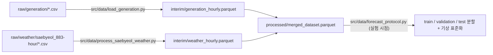

# `data/` 디렉터리 안내

상명풍력 시간별 발전량 예측 실험에서 사용하는 원본 자료와 처리 자료를 설명합니다. 모든 내용은 **2026-10-05 기준 저장소 파일과 코드에서 직접 확인한 사실**입니다. 공식 명세로 확인되지 않은 가정은 별도로 표시했습니다.

## 1. 폴더 구조

```text
data/
├── raw/                                   # 원본
│   ├── generation/
│   │   └── 한국중부발전(주)_(AI 친화 데이터)풍력 발전 실적(상명풍력)_20260330.csv
│   └── weather/
│       └── saebyeol_883-hour/             # AWS 883 시간자료
│           ├── SURFACE_AWS_883_HR_2023_2023_2024.csv
│           ├── SURFACE_AWS_883_HR_2024_2024_2025.csv
│           └── SURFACE_AWS_883_HR_2025_2025_2026.csv
│
├── interim/                               # 중간 산출물
│   ├── generation_hourly.parquet
│   └── weather_hourly.parquet
└── processed/                             # 모델 입력 최종 데이터셋
    └── merged_dataset.parquet
```

| 폴더 | 성격 | 생성 주체 | Git |
|---|---|---|---|
| `raw/` | 외부에서 내려받은 원본. 직접 편집하지 않습니다. | 수동 다운로드 | 분자료 폴더는 `.gitignore`로 제외 (약 100 MB) |
| `interim/` | 원본을 정형화한 중간 결과 | `src/data/` 스크립트 | 추적 |
| `processed/` | 실험 코드가 읽는 단일 입력 파일 | `src/data/process_saebyeol_weather.py` | 추적 |

## 2. 원본 자료 (`raw/`)

### 2.1 발전량 — `raw/generation/`

| 항목 | 내용 |
|---|---|
| 파일 | `한국중부발전(주)_(AI 친화 데이터)풍력 발전 실적(상명풍력)_20260330.csv` |
| 출처 | 파일명 기준 한국중부발전(주) "AI 친화 데이터" 풍력 발전 실적. 발전소는 상명풍력 1곳(호기 값 `1`)이며 설정상 정격 21 MW(3 MW × 7기)입니다. |
| 인코딩 | CP949 |
| 형식 | 하루 1행의 wide 형식: `기준일, 호기, 1시, 2시, …, 24시` |
| 기간 | 2023-01-01 ~ 2026-03-30 (1,185개 날짜 행 + 완전히 빈 행 1개) |
| 값 결측 | 2026-01-31, 2026-02-03, 2026-02-15 (각각 24시간, 합계 72시간). 2023~2025년에는 결측이 없습니다. |
| 단위 | 원자료에 단위 표기가 없습니다. 아래 3.1의 **단위 가정**을 참고하십시오. |

### 2.2 기상 시간자료 — `raw/weather/saebyeol_883-hour/`

| 항목 | 내용 |
|---|---|
| 관측소 | 기상청 AWS 883 새별오름 (제주시 애월읍, 해발 435 m, 발전소에서 약 6.5 km) |
| 인코딩 | CP949 |
| 열 | `지점, 일시, 기온(°C), 풍향(deg), 풍속(m/s), 강수량(mm), 현지기압(hPa), 해면기압(hPa), 습도(%), 일사(MJ/m^2), 일조(hr)` |
| 기간 | 2023-01-01 00:00 ~ 2025-12-31 23:00 |
| 행 수 | 2023: 8,760 / 2024: 8,765 (윤년 8,784시간 중 19개 시각 누락) / 2025: 8,760 |
| 비고 | `일사`, `일조`는 비어 있어 처리 과정에서 버립니다. **2026년 시간자료는 없습니다.** |

## 3. 처리 파이프라인



### 3.1 `interim/generation_hourly.parquet`

- **생성 코드:** [`src/data/load_generation.py`](../src/data/load_generation.py)의 `build_and_save_generation_interim()`
- **처리 순서**
  1. 인코딩을 자동 판별(CP949 → EUC-KR → UTF-8)해 읽고, 모든 열이 빈 행과 `기준일`이 없는 행을 제거합니다.
  2. **wide → long 변환:** `1시~24시` 열을 시간 행으로 펼칩니다. `datetime = 기준일 + N시간`이므로 **`24시`는 다음 날 00:00**이 됩니다. 각 값은 해당 시각에 끝나는 1시간 구간의 실적으로 해석합니다. 따라서 전체 범위는 2023-01-01 01:00 ~ 2026-03-31 00:00, 총 28,440시간입니다.
  3. **단위 정규화 (가정):** 원값의 크기가 2025-02-01을 기준으로 약 1,000배 바뀌는 불연속이 있어, 21 MW 정격에 맞도록 다음과 같이 MWh로 환산합니다.
     - `기준일 < 2025-02-01`: Wh로 가정해 `raw / 1,000,000`
     - `기준일 ≥ 2025-02-01`: kWh로 가정해 `raw / 1,000`
     - 기준일로 판정하므로 2025-01-31의 `24시`(= 2025-02-01 00:00)는 Wh로 처리됩니다.
     - 환산 후 최댓값은 20.109 MWh로 정격을 넘지 않습니다. **이 단위 구분은 공식 명세로 확인되지 않은 추정입니다.**
  4. 품질 플래그를 붙입니다. 0은 결측으로 바꾸지 않고 실제 영발전으로 보존합니다.
- **결과:** 28,440행 × 9열. 유효값 28,368개, 결측 72개(모두 2026년), 정확한 0은 4,976개입니다. 정격 초과와 음수는 0건입니다.

| 열 | 설명 |
|---|---|
| `datetime` | 구간 종료 시각 (시간대 정보 없음, 현지 시각으로 가정) |
| `base_date`, `hour` | 원자료의 `기준일`과 시(1~24) |
| `raw_generation` | 원자료 값 그대로 |
| `generation_mwh` | MWh로 환산한 **예측 대상 변수** |
| `scale_unit_assumed` | 환산 시 가정한 단위 (`Wh` / `kWh`) |
| `is_capacity_exceeded`, `is_negative`, `is_zero` | 21 MWh 초과 / 음수 / 정확한 0 여부 |

### 3.2 `interim/weather_hourly.parquet`

- **생성 코드:** [`src/data/process_saebyeol_weather.py`](../src/data/process_saebyeol_weather.py)의 `load_and_clean_saebyeol_weather()` → `clean_hourly_weather()`
- **처리 순서**
  1. `saebyeol_883-hour/`의 CSV를 모두 읽어 이어 붙입니다. 열 이름을 영문으로 바꾸고(`aws_temperature`, `aws_wind_speed` 등), 시각순 정렬 후 중복 시각을 제거합니다.
  2. 변수 7개(기온·풍속·풍향·습도·현지기압·해면기압·강수량)만 남깁니다.
  3. 첫 시각부터 마지막 시각까지 **빈틈없는 1시간 격자**로 재색인합니다. 누락 시각은 결측 행이 되며, 마지막 관측(2025-12-31 23:00) 이후로는 연장하지 않습니다.
  4. 변수마다 **과거 방향 forward-fill을 최대 3시간**까지만 적용합니다. 미래 값을 쓰는 보간은 하지 않습니다. 변수마다 다음 보조 열을 기록합니다.
     - `<변수>_is_missing`: 원래 관측이 없었던 시각
     - `<변수>_is_imputed`: 그중 forward-fill로 채운 시각
     - `<변수>_age_hours`: 마지막 실제 관측 이후 경과 시간
  5. 풍향(채운 뒤 값)을 `aws_wind_dir_sin`, `aws_wind_dir_cos`로 변환합니다 ([`src/features/wind_direction.py`](../src/features/wind_direction.py)).
- **결과:** 26,304행 × 31열 (2023-01-01 00:00 ~ 2025-12-31 23:00). 예를 들어 풍속은 원래 결측 37시간 중 18시간이 채워졌고, 3시간보다 긴 공백인 19시간은 결측으로 남습니다.
- **가정:** 각 시각의 관측은 해당 구간이 끝나는 즉시 쓸 수 있다고 가정합니다. 실제 배포 지연은 확인되지 않았습니다.

### 3.3 `processed/merged_dataset.parquet` (실험 입력)

- **생성 코드:** [`src/data/process_saebyeol_weather.py`](../src/data/process_saebyeol_weather.py)의 `build_and_save_master_dataset()`
- **처리 순서**
  1. 3.2를 실행해 `interim/weather_hourly.parquet`를 저장합니다.
  2. `interim/generation_hourly.parquet`를 기준으로 `datetime`에 **left join**합니다. 발전량의 모든 시각을 유지합니다.
  3. 시간 주기 특징(`hour_*`, `day_of_year_*`, `month_*`의 sin/cos)을 추가합니다 ([`src/features/time_features.py`](../src/features/time_features.py)).
  4. 기상이 없는 행은 `_is_missing=True`, `_is_imputed=False`로 채웁니다. **2026년 행은 기상 값이 전부 결측**이며, 대체값으로 채우지 않습니다.
- **결과:** 28,440행 × 45열, 2023-01-01 01:00 ~ 2026-03-31 00:00

| 열 그룹 | 열 |
|---|---|
| 발전량 (3.1과 동일) | `datetime, base_date, hour, raw_generation, generation_mwh, scale_unit_assumed, is_capacity_exceeded, is_negative, is_zero` |
| 기상 값 | `aws_temperature, aws_wind_speed, aws_wind_direction, aws_humidity, aws_local_pressure, aws_sea_level_pressure, aws_precipitation, aws_wind_dir_sin, aws_wind_dir_cos` |
| 기상 품질 | 변수 7개 × `_is_missing / _is_imputed / _age_hours` |
| 달력 | `hour_sin, hour_cos, day_of_year_sin, day_of_year_cos, month_sin, month_cos` |

| 범위 | 행 | 유효 발전량 | 정확한 0 | 사용 기상 6종 중 하나라도 결측인 행 |
|---|---|---|---|---|
| 전체 파일 | 28,440 | 28,368 | 4,976 | — |
| 2023~2025 (연구 기간) | 26,303 | 26,303 | 4,799 (18.25%) | 61 |
| 2026-01 ~ 03 | 2,137 | 2,065 | 177 | 2,137 (기상 없음) |

연도는 `datetime` 기준입니다. 2026 행에는 원자료 2025-12-31 `24시` 값인 2026-01-01 00:00이 포함됩니다. 이를 빼면 2026년 기준일의 유효 발전량은 2,064시간입니다.

> **이 파일에는 표준화나 데이터 분할이 들어 있지 않습니다.** 둘 다 실험을 실행할 때 [`src/data/forecast_protocol.py`](../src/data/forecast_protocol.py)의 `prepare_splits()`에서 수행합니다.
> - 분할 기간 ([`configs/base_config.yaml`](../configs/base_config.yaml)): 학습 2023-01-01 01:00 ~ 2024-06-30 23:00, 검증 2024-07-01 ~ 2024-12-31, 평가 2025-01-01 ~ 2025-12-31. 2026년은 어떤 분할에도 포함되지 않습니다.
> - 모델 입력: `generation_mwh`와 기상 6종(`aws_wind_speed, aws_wind_dir_sin, aws_wind_dir_cos, aws_temperature, aws_humidity, aws_local_pressure`)입니다. 기상 표준화의 평균과 표준편차는 **학습 구간에서만** 계산합니다.
> - 결측이 남은 입력 창은 시간축을 압축하지 않고 표본에서 제외합니다.

## 4. 재생성과 검증

저장소 루트에서 실행합니다(상대 경로를 사용하므로 다른 위치에서 실행하면 파일을 찾지 못합니다). 패키지 환경은 루트의 `environment.yml` / `requirements.txt`를 사용하며, `pyarrow`가 필요합니다.

```bash
python -m src.data.load_generation            # → data/interim/generation_hourly.parquet
python -m src.data.process_saebyeol_weather   # → data/interim/weather_hourly.parquet, data/processed/merged_dataset.parquet
```

2026-10-05에 위 두 함수를 임시 경로로 다시 실행해, 세 파일 모두 저장된 파일과 내용이 같음을 확인했습니다(`pandas.testing.assert_frame_equal`). 실험 manifest(`reports/*_manifest.json`의 `processed_data_sha256`)는 아래 해시를 기록하고 있으며, 분석·검증 스크립트는 실행 전에 이 해시를 대조합니다. parquet 바이트는 `pyarrow` 버전에 따라 달라질 수 있으므로, 해시가 다르면 내용 비교로 확인하십시오.

| 파일 | SHA-256 |
|---|---|
| `processed/merged_dataset.parquet` | `01861a5a18cac3731f4238d9307d03e2bb29d9c3aa11e8640abef42dc6d0f9b4` |
| `interim/generation_hourly.parquet` | `b623a87223dcf12727a388e5e051f341f89c83967619d88bc6b096fb42d57aaf` |
| `interim/weather_hourly.parquet` | `f253ba7d304594228aa2521591616514004f26f66a908d0c00b36f0d42bebfc7` |
| `raw/generation/…_20260330.csv` | `f8da66c0a92f0454c9b1e4036edccca9546388096562de18a5e87e7308689a06` |
| `raw/weather/saebyeol_883-hour/…_2023_2023_2024.csv` | `fded8d75c0a7338deae732fc6f7842ea9664f317830ffc7dec3814ea491bd656` |
| `raw/weather/saebyeol_883-hour/…_2024_2024_2025.csv` | `1c2b4769b343aedb247df218f49ecd9cb7ac7d3830af02e8c4ce74491e1241a8` |
| `raw/weather/saebyeol_883-hour/…_2025_2025_2026.csv` | `068100dfc08943d18bf7e45a1a2803b36b748edae45b819314b079b99663c32b` |

> [!WARNING]
> 아래 코드는 `data/`를 덮어쓰거나 현재 파이프라인과 다르게 동작합니다.
> - `python -m src.experiments.run_comprehensive_extended_matrix`: 실험을 돌리기 전에 위 두 단계를 다시 실행해 `interim/`과 `processed/`를 갱신합니다.
> - `src/data/merger.py`: 이전 단계의 병합 코드입니다. 직접 실행하면 **기상 없이 발전량만 있는** `merged_dataset.parquet`로 덮어씁니다. 현재 파이프라인에서는 사용하지 않습니다.
> - `src/data/load_weather.py`, `src/data/aggregate_weather.py`: 이전 단계의 보조 코드로 현재 산출물 생성에 쓰이지 않습니다. `aggregate_weather.py`는 분자료와 열 이름이 맞지 않아 그대로는 동작하지 않습니다.
> - `configs/base_config.yaml`의 `raw_weather_saebyeol_info`(관측환경정보 xlsx)와 `raw_weather_geumak_dir`(AWS 993 제주금악)는 저장소에 없는 경로입니다. 현재 파이프라인은 이 파일들을 읽지 않습니다.

`src/data/clean_generation.py`는 데이터를 바꾸지 않습니다. `interim/generation_hourly.parquet`를 읽어 `reports/tables/`(연·월별 요약, 영발전 연속 구간 등)와 `reports/figures/generation_eda_overview.png`만 생성합니다. 이 결과에는 2026년 기술통계도 포함됩니다.

## 5. 원본 자료 다시 받기

- **발전량:** 한국중부발전(주)의 "AI 친화 데이터" 풍력 발전 실적(상명풍력) CSV입니다. 파일명 끝의 `20260330`은 자료의 마지막 날짜와 같습니다.
- **기상:** 기상청 기상자료개방포털의 방재기상관측(AWS) 자료, 지점 883(새별오름). 시간자료를 `saebyeol_883-hour/`에 내려받은 파일명 그대로 두면 됩니다. 처리 코드는 폴더 안의 `*.csv`를 모두 읽습니다.

## 6. 확인되지 않은 사항 (공식 명세 필요)

- 발전량 단위(2025-02-01 전후 Wh/kWh 가정), 총발전량과 송전단 순발전량의 구분, `1시~24시`의 정확한 집계 구간과 시간대
- 21 MW 정격이 기간 내내 유지되었는지 여부, 정비·부분 가동·출력제어 이력, 0이 결측을 대신한 값인지 여부
- 2026년 결측 3일의 원인
- 발전량과 AWS 자료의 실제 배포 지연 (현재는 구간 종료 즉시 가용하다고 가정)

## 7. 2026년 자료에 관한 메모

- 2026-01 ~ 03 발전량(유효 2,065시간)은 학습·검증·평가와 모델·설정 선택에 **사용하지 않았습니다**.
