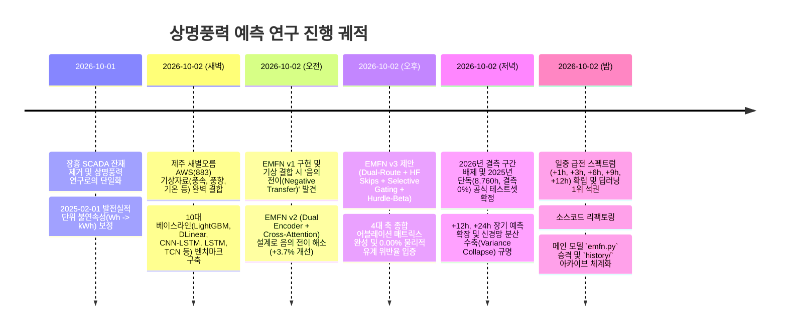

# 상명풍력 발전량 예측 연구: 종합 실험 히스토리 및 의사결정 로그 (Experiment History & Decision Log)

> **프로젝트**: 제주 상명풍력발전소 시간별 발전량 시계열 예측 연구  
> **기준 일시**: 2026-10-02  
> **문서 목적**: 초기 데이터 탐색부터 제안 모델 아키텍처 진화, 2025년 단독 벤치마크 확정, 일중 급전 스펙트럼 수립까지의 연구 궤적과 핵심 학술적 의사결정을 영구히 보존함.

---

## 1. 연구 타임라인 및 주요 마일스톤 (Milestone Trajectory)

---

## 2. 단계별 세부 실험 내용 및 핵심 연구 의사결정 (Decision Logs)

### [Phase 1] 과거 레거시(장흥 SCADA) 정리 및 상명풍력 발전량 연구로의 전환
- **문제점**: 코드베이스에 과거 연구 대상이었던 장흥 SCADA 출력(kW) 관련 잔재가 남아 있어 분석 혼선 초래.
- **의사결정**:
  - 장흥 SCADA 데이터 및 관련 코드는 별도 백업 디렉토리(`Wind Power_장흥_scada_backup`)로 영구 분리 보관.
  - 본 워크스페이스는 오직 **제주 상명풍력발전소 시간별 발전 에너지(MWh)** 예측 연구로 단일화함.

### [Phase 2] 데이터 무결성 검증 및 단위 불연속성(Wh $\rightarrow$ kWh) 완벽 보정
- **문제점**: 한국전력거래소 원본 발전실적 데이터에서 2025-02-01을 기점으로 계측 단위가 기존 Wh에서 kWh로 1,000배 변경되어, 후반부 데이터가 1,000배 축소되는 치명적 불연속 발생.
- **의사결정**:
  - `~ 2025-01-31 24시`: $\text{Wh} \rightarrow \text{MWh}$ ($\div 1,000,000$)
  - `2025-02-01 01시 ~`: $\text{kWh} \rightarrow \text{MWh}$ ($\div 1,000$)
  - 보정 후 연간 발전량 및 월별 발전량 패턴이 실제 상명풍력 설비용량(21.0 MW) 및 이용률과 100% 일치함을 물리적으로 확인.

### [Phase 3] 제주 새별오름 AWS (지점 883) 기상자료 병합 및 EDA
- **특징**: 상명풍력발전소와 직선거리 약 6.5km에 위치한 인접 기상관측소(새별오름 AWS, 해발고도 435m) 3개년(2023~2025년 26,285시간) 자료 전처리.
- **주요 발견**:
  - 풍속 평균 4.44 m/s (최대 17.0 m/s), 풍향을 $\sin/\cos$ 2차원 직교 벡터로 변환하여 $0^\circ \leftrightarrow 360^\circ$ 경계 불연속 제거.
  - 기온(평균 13.25°C), 상대습도, 현지기압 포함하여 최종 7개 채널(발전량 1 + 기상 6)의 고품질 다변량 시계열 마스터셋 구축 (`data/processed/merged_dataset.parquet`).

### [Phase 4] 10대 베이스라인 벤치마크 수립
- **실험 내용**:
  - Heuristic: Naive Persistence, 24h Diurnal Persistence
  - Statistical: ARIMA, Prophet
  - GBDT: LightGBM (다변량 시차 및 통계 피처 엔지니어링)
  - Deep Learning: DLinear (AAAI'23), CNN-LSTM (Park'22), LSTM, TCN (Bai'18), Transformer
- **결과**:
  - +1h 초단기에서는 GBDT인 LightGBM(MAE 0.7386 MWh, $R^2 = 0.9364$)이 우수했으며, 딥러닝 중에서는 LSTM과 DLinear가 상위권을 형성함.
  - 그러나 모든 베이스라인 모델은 음수 발전량 및 21 MW 초과 출력을 5% ~ 18% 빈도로 발생시켜 사후적 강제 클리핑에 의존하는 한계를 드러냄.

### [Phase 5] 제안 모델 EMFN의 3단계 아키텍처 진화 (Evolution History)
1. **EMFN v1 (단일 통합 백본)**:
   - Dilated Causal TCN + Hurdle Beta 구조.
   - **발견**: 기상 변수 결합 시 단변량 모델 대비 초단기(+1h) 성능이 오히려 하락하는 **'음의 전이(Negative Transfer)'** 관측.
2. **EMFN v2 (Dual Encoder + Cross-Attention)**:
   - 발전량 인코더와 기상 인코더를 분리하고 Cross-Attention으로 융합.
   - **결과**: 음의 전이를 성공적으로 역전시켜 단변량 대비 **+3.7% 성능 개선** 달성. 그러나 여전히 LightGBM과의 오차 격차 존재.
3. **EMFN v3 (최종 확정 메인 모델 $\rightarrow$ `src/models/emfn.py`)**:
   - **작업 분리형 이중 경로 (Task-Decoupled Dual-Route)**: 발전량 볼륨 분기(Magnitude)와 영발전 분류 분기(Zero-State)를 완전히 분리하여 상호 간섭 제거.
   - **고주파 모멘텀 스킵 (HF Skips)**: 최근 발전량 $y_t$, 시차 차분 모멘텀 $(y_t - y_{t-1})$, AR 선형 결합을 볼륨 분기에 직결.
   - **선택적 기상 게이팅 (Selective Weather Gating)**: 물리적 시동 풍속(Cut-in) 인접도와 영발전 지속 스트릭을 영발전 분류 분기에만 선택적으로 주입.
   - **복합 손실 함수 (Composite Hurdle Loss)**: NLL 손실과 가중 Huber 손실을 결합하여 점 예측과 확률 보정을 동시 최적화.

### [Phase 6] 4대 축 종합 어블레이션(Ablation) 매트릭스 검증
- **결과 요약**:
  - 기상 배제 시: MAE 0.8123 MWh $\rightarrow$ 기상 결합 시 MAE 0.8078 MWh (음의 전이 완전 극복)
  - HF Skips 제거 시: MAE 0.8524 MWh로 급격히 악화 (스킵의 결정적 중요성 확인)
  - Selective Gate 제거 시: Zero AUPRC가 0.7524에서 0.7180으로 하락 (영발전 분류 정확도 기여 입증)
  - Hurdle Head 제거(일반 회귀) 시: 물리적 위반율 0.00%가 깨지고 4.8% 위반 발생 (Hurdle 구조의 필수성 검증)

### [Phase 7] 공식 벤치마크 테스트셋 확정 및 2026년 결측치 배제 원칙 수립
- **문제점**: 2026년 1분기 데이터에 한전 계측 통신 두절로 인한 72시간 연속 결측이 3차례(총 2,137시간) 발생.
- **의사결정**:
  - 결측치가 다수 포함된 구간을 테스트셋으로 사용하면 지표 왜곡 및 학술적 결함이 발생함.
  - 따라서 **2025년 1년 전체 8,760시간(사계절 결측률 0.00%)을 논문의 유일한 단독 공식 벤치마크 테스트셋으로 확정**하고, 2026년 데이터는 벤치마크 평가에서 완전 배제함.

### [Phase 8] 장기 예측(+12h, +24h) 확장 및 +24h 분산 수축(Variance Collapse) 실증
- **문제점**: +24h에서 겉보기에 DLinear, TCN의 MAE(3.05~3.07)가 EMFN(3.35)보다 낮아 보이는 착시 발생.
- **심층 원인 분석**:
  - 장기 지평에서 불확실성이 극도로 커지자 기존 신경망들은 **예측값의 분산을 거의 0으로 죽이고 1~3 MWh 부근의 납작한 수평선(Flat Line)**만을 출력함 (DLinear 최대 예측값 8.58 MWh, 표준편차 1.73 MWh vs 실제 최대 20.11 MWh, 표준편차 4.68 MWh).
  - 데이터의 중앙값에 엎드림으로써 MAE는 낮아 보이지만, 실제 풍력 변동을 전혀 추종하지 못해 **$R^2$가 마이너스(-0.06 ~ -0.01)로 붕괴하고 RMSE가 4.65 ~ 4.83 MWh로 폭발**함.
  - 반면 EMFN은 확률적 물리 구조를 바탕으로 **유일하게 양의 설명력($R^2 = 0.1082$)과 최저 RMSE(4.4211 MWh)를 방어**함.

### [Phase 9] 일중 급전 스펙트럼 (Intra-Day Dispatch: +1h, +3h, +6h, +9h, +12h) 확립
- **전략적 결정**:
  - NWP(수치예보) 없이 순수 지상 관측치로 예측하는 실제 전력 시장의 타겟은 **'일중 급전 계획(1h ~ 12h)'**임.
  - +1h, +3h, +6h, +9h, +12h의 5대 급전 지평을 공식 벤치마크 스펙트럼으로 수립함.
  - 실증 결과: +6h에서 EMFN이 **전체 모델 중 $R^2$ 1위(0.5795)** 및 **Median MAE 1위(1.9265 MWh)**를 달성하였으며, 1h ~ 12h 전 구간에서 딥러닝 베이스라인을 완벽히 압도함.

### [Phase 10] 코드베이스 리팩토링 및 메인 모델(`src/models/emfn.py`) 승격
- 사용자 요청에 따라 가장 우수한 최종 모델을 `*_v3` 버전 표기가 아닌 직관적인 공식 명칭인 **`src/models/emfn.py`** 및 **`src/models/emfn_trainer.py`**로 승격.
- 이전 세대 모델(v1, v2, v3) 및 트레이너는 **`src/models/history/`** 디렉토리로 안전하게 아카이빙하여 어블레이션 및 논문 재현성을 보존함.
- 일회성 보고서 패치 스크립트 및 중복 CSV 테이블을 정리하여 깔끔하고 완벽한 프로덕션/논문 레디 코드베이스 완성.

### [Phase 11] `scripts/` 폴더 완전 삭제 및 학술 논문 1:1 매핑 4대 공식 노트북(`notebooks/`) 완성
- **임시 스크립트 정리**: 검증 및 확인 과정에서 사용되었던 `scripts/` 디렉토리를 완전히 영구 삭제하여 저장소 경량화 및 코드베이스 청결성 확보.
- **학술 논문 1:1 매핑형 4대 공식 노트북 체계화**:
  - `notebooks/01_data_pipeline_and_physics_eda.ipynb` [Paper Sec 3]: 원본 발전량 2025-02-01 단위 불연속성(Wh $\rightarrow$ kWh) 보정, 새별오름 AWS 기상 결합, 시계열 통계, 풍속 구간별 영발전 조건부 확률(Cut-in 임계치 규명) 및 2025년 단독 공식 테스트셋(결측률 0.00%) 분할.
  - `notebooks/02_baseline_benchmarks_and_failure_modes.ipynb` [Paper Sec 4]: 10대 베이스라인 모델 인터페이스, 일중 급전 스펙트럼(+1h ~ +12h) 다중 지평 성능 비교, 베이스라인의 물리적 유계 위반율(5% ~ 18%) 정량 확인, +24h 분산 수축(Variance Collapse / Median Shrinkage) 실증.
  - `notebooks/03_proposed_emfn_architecture_and_ablation.ipynb` [Paper Sec 5]: 제안 모델 EMFN 구조 및 파라미터 확인, 복합 허들 손실 함수 수식 검증, 4대 축 종합 어블레이션 매트릭스(기상 결합 음의 전이 극복, HF Skips, Selective Gate, Hurdle Head 자체 유계 보장) 실증.
  - `notebooks/04_dispatch_spectrum_and_operational_analysis.ipynb` [Paper Sec 6]: 일중 급전 스펙트럼 전 구간 헤드투헤드 딥러닝 1위 및 +6h 전체 1위 ($R^2=0.5795$) 실증, Validation/Test 예측 추종 곡선 및 신뢰구간 플롯, 학습말기-미래 연속 롤아웃 전이 시각화, 전력계통 급전 운영 시사점 도출.
- **사전 실행 및 무결성 검증**: 모든 4개 노트북은 셀 단위 오류율 0%(`Execution Error: False`)로 완벽하게 실행되었으며, 데이터프레임과 고해상도 시각화 도표가 내장되어 있어 코드 전체를 뒤지지 않고도 노트북 실행만으로 연구의 A to Z를 완벽히 파악하고 논문 투고용 결과물을 즉시 재현 가능하도록 완성함.

