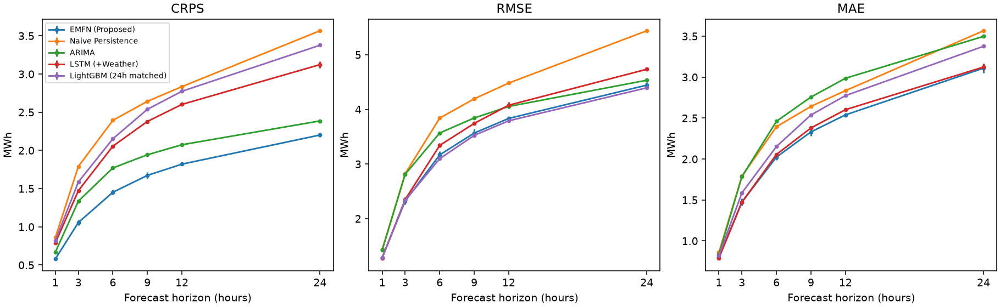
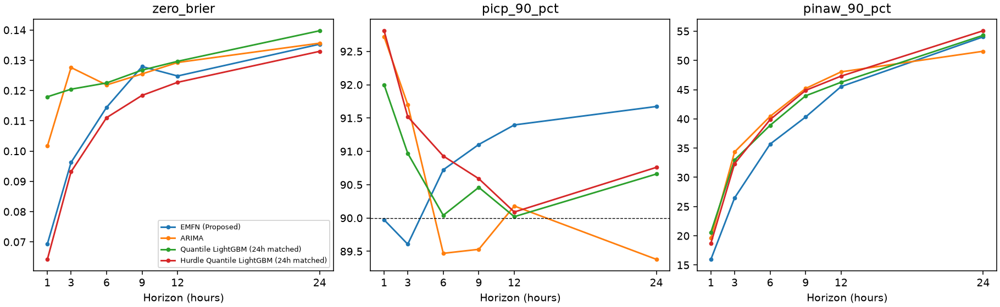

# 전체 베이스라인 재실험과 노트북 동기화

실행 `all_baselines_20261005T143556+0900`. **15개 모델 계열, 6개 시계, 234개 모델·시계·시드 조합, 검증/개발 평가 468행**을 새로 계산했습니다. 완료된 기존 run의 가중치·예측을 재사용하지 않았으며 2026년 예측 성능을 계산하지 않았습니다. 연구의 주 지표는 CRPS, 핵심 보조 지표는 영발전 Brier입니다.

## 학습 범위와 변경

- 신경망 7종 × 6시계 × 3시드 = **126개 학습**: EMFN, DLinear, LSTM, GRU, CNN-LSTM, TCN, Transformer.
- LightGBM 4종 × 6시계 × 3시드 = **72개 모델 묶음 학습**: 168h lag·달력 기준선, 24h 점예측, 24h 직접 분위수, 24h 허들 분위수. 분위수 모델 묶음은 여러 개 트리를 적합합니다.
- ARIMA 후보 **5개를 새로 적합**해 수렴 후보 중 각 시계의 검증 CRPS로 차수를 선택했습니다. 파라미터는 고정하고 각 발행 시각까지의 관측으로 상태만 필터링합니다.
- Prophet은 **3개 시드별 적합**, 동일한 train-only 달력 예측을 6시계에서 각각 평가했습니다. 일간·주간·연간 계절성, changepoint prior 0.05를 유지합니다. 최근 관측을 매 시점 다시 적합하는 rolling baseline이 아니며 학습 기간이 2년 미만이어서 연간 계절성 식별에 한계가 있습니다. Prophet의 구간 출력은 사용하지 않은 점예측 평가입니다.
- Naive/Diurnal Persistence **12개 시계 조합**을 공통 표본에서 다시 계산했습니다. 결정론 모델의 시드를 복제해 SD를 만들지 않습니다.
- **GRU의 마지막 ReLU를 선형 출력으로 변경**했습니다. 음수 초기 출력에서 기울기가 끊기는 경로를 제거하며 공통 평가기의 clipping은 유지합니다. 수정 전 GRU의 0 수렴 결과와 별도 실행으로 기록합니다.
- 장기 lag LightGBM은 검증 CRPS early stopping과 NaN 자체 처리를 적용했습니다. 24h 공통 표본은 유지하지만 최대 168h lag와 달력 특징을 쓰므로 입력 예산이 다릅니다. 과거 실행 대비 차이를 단일 수정의 효과로 해석하지 않습니다.

시드: 42·2026·3407. 신경망·트리 선택은 검증 CRPS, Persistence는 고정 규칙, Prophet은 고정 설정입니다. 손실 함수와 학습 예산이 완전히 동일한 아키텍처 실험은 아닙니다. 모든 모델의 발행/타깃 시각과 정답을 대조했습니다. 검증 상수 예측 경고는 **0개**입니다.

## 본문용 간결한 표

표준 모델 중심의 **EMFN, Naive Persistence, ARIMA, LSTM, 일반 LightGBM(24h)** 구성입니다. 이 배치는 결과를 이미 열람한 뒤 정한 편집 결정입니다. CNN-LSTM·확률 LightGBM·나머지 모델도 삭제하지 않고 전체 표에 남깁니다.

| model | horizon_hours | n_fits | crps | zero_brier | rmse | mae | zero_auprc |
|---|---|---|---|---|---|---|---|
| EMFN (Proposed) | 1 | 3 | 0.5802 ± 0.0058 | 0.0693 ± 0.0017 | 1.2879 ± 0.0155 | 0.8003 ± 0.0099 | 0.7516 ± 0.0028 |
| Naive Persistence | 1 | 1 | 0.8602 | N/A | 1.4337 | 0.8602 | N/A |
| ARIMA | 1 | 1 | 0.6689 | 0.1017 | 1.4261 | 0.8369 | 0.6213 |
| LSTM (+Weather) | 1 | 3 | 0.7899 ± 0.0147 | N/A | 1.2806 ± 0.0244 | 0.7900 ± 0.0147 | N/A |
| LightGBM (24h matched) | 1 | 3 | 0.8209 ± 0.0000 | N/A | 1.2867 ± 0.0000 | 0.8209 ± 0.0000 | N/A |
| EMFN (Proposed) | 6 | 3 | 1.4529 ± 0.0329 | 0.1144 ± 0.0006 | 3.1678 ± 0.0647 | 2.0239 ± 0.0378 | 0.4343 ± 0.0043 |
| Naive Persistence | 6 | 1 | 2.3944 | N/A | 3.8407 | 2.3944 | N/A |
| ARIMA | 6 | 1 | 1.7710 | 0.1218 | 3.5683 | 2.4608 | 0.4102 |
| LSTM (+Weather) | 6 | 3 | 2.0561 ± 0.0100 | N/A | 3.3406 ± 0.0387 | 2.0561 ± 0.0099 | N/A |
| LightGBM (24h matched) | 6 | 3 | 2.1528 ± 0.0000 | N/A | 3.0982 ± 0.0000 | 2.1528 ± 0.0000 | N/A |
| EMFN (Proposed) | 24 | 3 | 2.2019 ± 0.0276 | 0.1353 ± 0.0008 | 4.4437 ± 0.0490 | 3.1100 ± 0.0565 | 0.2363 ± 0.0040 |
| Naive Persistence | 24 | 1 | 3.5668 | N/A | 5.4388 | 3.5668 | N/A |
| ARIMA | 24 | 1 | 2.3865 | 0.1356 | 4.5334 | 3.4982 | 0.2284 |
| LSTM (+Weather) | 24 | 3 | 3.1235 ± 0.0422 | N/A | 4.7340 ± 0.0299 | 3.1235 ± 0.0422 | N/A |
| LightGBM (24h matched) | 24 | 3 | 3.3772 ± 0.0000 | N/A | 4.3946 ± 0.0000 | 3.3772 ± 0.0000 | N/A |

±는 개별 학습 점수의 표본 SD이며 시드 앙상블이 아닙니다. 시드가 없는 실행은 SD를 표시하지 않습니다. N/A는 확률 출력이 없는 모델에 해당 지표를 부여하지 않았다는 뜻입니다. RMSE에는 분포 평균, MAE에는 분포 중앙값을 사용하며 점모델은 자체 clipped 출력을 사용합니다. Dirac CRPS=MAE이므로 확률 모델만의 우월성을 이 비교만으로 입증할 수 없습니다.



## 전체 비교의 관찰

모든 15개 모델을 포함한 시계별 평균 CRPS 최저값:

| horizon_hours | model | crps_mean |
|---|---|---|
| 1 | EMFN (Proposed) | 0.580223 |
| 3 | EMFN (Proposed) | 1.056345 |
| 6 | Hurdle Quantile LightGBM (24h matched) | 1.438614 |
| 9 | Hurdle Quantile LightGBM (24h matched) | 1.667924 |
| 12 | Hurdle Quantile LightGBM (24h matched) | 1.812986 |
| 24 | Quantile LightGBM (24h matched) | 2.162791 |

확률 출력 모델의 시계별 평균 영발전 Brier 최저값:

| horizon_hours | model | zero_brier_mean |
|---|---|---|
| 1 | Hurdle Quantile LightGBM (24h matched) | 0.06425 |
| 3 | Hurdle Quantile LightGBM (24h matched) | 0.093175 |
| 6 | Hurdle Quantile LightGBM (24h matched) | 0.111045 |
| 9 | Hurdle Quantile LightGBM (24h matched) | 0.118403 |
| 12 | Hurdle Quantile LightGBM (24h matched) | 0.12272 |
| 24 | Hurdle Quantile LightGBM (24h matched) | 0.13295 |

순위는 동일 개발 구간의 기술적 비교이며 통계적 유의성·독립 검증의 결론이 아닙니다. 단순 모델을 본문에 배치하더라도 확률 베이스라인 결과를 함께 언급해야 합니다. 구간 포함률과 구간 폭을 같이 해석하며, 어떤 모델이 모든 시계에서 잘 보정됐다고 일반화하지 않습니다. 기존 실행의 paired block 구간은 이 새 실행의 유의성 구간으로 재사용하지 않았습니다.



## 전체 모델·시계의 주 지표

| model | horizon_hours | n_fits | crps | zero_brier | rmse | mae | zero_auprc |
|---|---|---|---|---|---|---|---|
| EMFN (Proposed) | 1 | 3 | 0.5802 ± 0.0058 | 0.0693 ± 0.0017 | 1.2879 ± 0.0155 | 0.8003 ± 0.0099 | 0.7516 ± 0.0028 |
| DLinear (+Weather) | 1 | 3 | 0.8461 ± 0.0225 | N/A | 1.3288 ± 0.0256 | 0.8461 ± 0.0225 | N/A |
| LSTM (+Weather) | 1 | 3 | 0.7899 ± 0.0147 | N/A | 1.2806 ± 0.0244 | 0.7900 ± 0.0147 | N/A |
| GRU (+Weather) | 1 | 3 | 0.8038 ± 0.0111 | N/A | 1.3023 ± 0.0163 | 0.8038 ± 0.0111 | N/A |
| CNN-LSTM (+Weather) | 1 | 3 | 0.8591 ± 0.0222 | N/A | 1.3810 ± 0.0286 | 0.8591 ± 0.0222 | N/A |
| TCN (+Weather) | 1 | 3 | 0.8557 ± 0.0611 | N/A | 1.3594 ± 0.0923 | 0.8557 ± 0.0611 | N/A |
| Transformer (+Weather) | 1 | 3 | 0.8603 ± 0.0134 | N/A | 1.3681 ± 0.0286 | 0.8603 ± 0.0135 | N/A |
| LightGBM (24h matched) | 1 | 3 | 0.8209 ± 0.0000 | N/A | 1.2867 ± 0.0000 | 0.8209 ± 0.0000 | N/A |
| Quantile LightGBM (24h matched) | 1 | 3 | 0.5960 ± 0.0000 | 0.1179 ± 0.0000 | 1.3950 ± 0.0000 | 0.8051 ± 0.0000 | 0.5986 ± 0.0000 |
| Hurdle Quantile LightGBM (24h matched) | 1 | 3 | 0.5813 ± 0.0000 | 0.0643 ± 0.0000 | 1.3489 ± 0.0000 | 0.7921 ± 0.0000 | 0.7585 ± 0.0000 |
| LightGBM (+Weather) | 1 | 3 | 0.7371 ± 0.0000 | N/A | 1.1716 ± 0.0000 | 0.7371 ± 0.0000 | N/A |
| Naive Persistence | 1 | 1 | 0.8602 | N/A | 1.4337 | 0.8602 | N/A |
| Diurnal Persistence | 1 | 1 | 3.5634 | N/A | 5.4338 | 3.5634 | N/A |
| ARIMA | 1 | 1 | 0.6689 | 0.1017 | 1.4261 | 0.8369 | 0.6213 |
| Prophet | 1 | 3 | 3.2132 ± 0.0000 | N/A | 4.7450 ± 0.0000 | 3.2132 ± 0.0000 | N/A |
| EMFN (Proposed) | 3 | 3 | 1.0563 ± 0.0363 | 0.0963 ± 0.0027 | 2.3238 ± 0.0652 | 1.4748 ± 0.0422 | 0.5601 ± 0.0114 |
| DLinear (+Weather) | 3 | 3 | 1.5687 ± 0.0158 | N/A | 2.4232 ± 0.0127 | 1.5688 ± 0.0158 | N/A |
| LSTM (+Weather) | 3 | 3 | 1.4730 ± 0.0040 | N/A | 2.3518 ± 0.0376 | 1.4729 ± 0.0040 | N/A |
| GRU (+Weather) | 3 | 3 | 1.4425 ± 0.0084 | N/A | 2.2927 ± 0.0313 | 1.4425 ± 0.0085 | N/A |
| CNN-LSTM (+Weather) | 3 | 3 | 1.5155 ± 0.0354 | N/A | 2.4192 ± 0.0637 | 1.5155 ± 0.0354 | N/A |
| TCN (+Weather) | 3 | 3 | 1.4607 ± 0.0099 | N/A | 2.3321 ± 0.0264 | 1.4607 ± 0.0098 | N/A |
| Transformer (+Weather) | 3 | 3 | 1.5511 ± 0.0127 | N/A | 2.4812 ± 0.0479 | 1.5512 ± 0.0127 | N/A |
| LightGBM (24h matched) | 3 | 3 | 1.5873 ± 0.0000 | N/A | 2.3372 ± 0.0000 | 1.5873 ± 0.0000 | N/A |
| Quantile LightGBM (24h matched) | 3 | 3 | 1.1104 ± 0.0000 | 0.1204 ± 0.0000 | 2.5131 ± 0.0000 | 1.4976 ± 0.0000 | 0.4632 ± 0.0000 |
| Hurdle Quantile LightGBM (24h matched) | 3 | 3 | 1.0878 ± 0.0000 | 0.0932 ± 0.0000 | 2.4442 ± 0.0000 | 1.4859 ± 0.0000 | 0.5554 ± 0.0000 |
| LightGBM (+Weather) | 3 | 3 | 1.4817 ± 0.0000 | N/A | 2.2238 ± 0.0000 | 1.4817 ± 0.0000 | N/A |
| Naive Persistence | 3 | 1 | 1.7905 | N/A | 2.8251 | 1.7905 | N/A |
| Diurnal Persistence | 3 | 1 | 3.5636 | N/A | 5.4342 | 3.5636 | N/A |
| ARIMA | 3 | 1 | 1.3362 | 0.1276 | 2.8134 | 1.7853 | 0.4755 |
| Prophet | 3 | 3 | 3.2136 ± 0.0000 | N/A | 4.7455 ± 0.0000 | 3.2136 ± 0.0000 | N/A |
| EMFN (Proposed) | 6 | 3 | 1.4529 ± 0.0329 | 0.1144 ± 0.0006 | 3.1678 ± 0.0647 | 2.0239 ± 0.0378 | 0.4343 ± 0.0043 |
| DLinear (+Weather) | 6 | 3 | 2.0319 ± 0.0042 | N/A | 3.1947 ± 0.0052 | 2.0319 ± 0.0042 | N/A |
| LSTM (+Weather) | 6 | 3 | 2.0561 ± 0.0100 | N/A | 3.3406 ± 0.0387 | 2.0561 ± 0.0099 | N/A |
| GRU (+Weather) | 6 | 3 | 2.0210 ± 0.0273 | N/A | 3.2213 ± 0.0330 | 2.0210 ± 0.0273 | N/A |
| CNN-LSTM (+Weather) | 6 | 3 | 2.0989 ± 0.0234 | N/A | 3.3455 ± 0.0689 | 2.0989 ± 0.0234 | N/A |
| TCN (+Weather) | 6 | 3 | 1.9574 ± 0.0059 | N/A | 3.1552 ± 0.0365 | 1.9574 ± 0.0058 | N/A |
| Transformer (+Weather) | 6 | 3 | 2.1067 ± 0.0302 | N/A | 3.3947 ± 0.0605 | 2.1068 ± 0.0302 | N/A |
| LightGBM (24h matched) | 6 | 3 | 2.1528 ± 0.0000 | N/A | 3.0982 ± 0.0000 | 2.1528 ± 0.0000 | N/A |
| Quantile LightGBM (24h matched) | 6 | 3 | 1.4523 ± 0.0000 | 0.1225 ± 0.0000 | 3.2009 ± 0.0000 | 1.9825 ± 0.0000 | 0.3889 ± 0.0000 |
| Hurdle Quantile LightGBM (24h matched) | 6 | 3 | 1.4386 ± 0.0000 | 0.1110 ± 0.0000 | 3.1548 ± 0.0000 | 1.9778 ± 0.0000 | 0.4227 ± 0.0000 |
| LightGBM (+Weather) | 6 | 3 | 2.0901 ± 0.0000 | N/A | 3.0558 ± 0.0000 | 2.0901 ± 0.0000 | N/A |
| Naive Persistence | 6 | 1 | 2.3944 | N/A | 3.8407 | 2.3944 | N/A |
| Diurnal Persistence | 6 | 1 | 3.5639 | N/A | 5.4349 | 3.5639 | N/A |
| ARIMA | 6 | 1 | 1.7710 | 0.1218 | 3.5683 | 2.4608 | 0.4102 |
| Prophet | 6 | 3 | 3.2140 ± 0.0000 | N/A | 4.7461 ± 0.0000 | 3.2140 ± 0.0000 | N/A |
| EMFN (Proposed) | 9 | 3 | 1.6732 ± 0.0404 | 0.1279 ± 0.0025 | 3.5666 ± 0.0758 | 2.3318 ± 0.0466 | 0.3469 ± 0.0233 |
| DLinear (+Weather) | 9 | 3 | 2.3695 ± 0.0079 | N/A | 3.6575 ± 0.0301 | 2.3695 ± 0.0079 | N/A |
| LSTM (+Weather) | 9 | 3 | 2.3796 ± 0.0120 | N/A | 3.7440 ± 0.0243 | 2.3796 ± 0.0120 | N/A |
| GRU (+Weather) | 9 | 3 | 2.3236 ± 0.0107 | N/A | 3.7021 ± 0.0288 | 2.3236 ± 0.0107 | N/A |
| CNN-LSTM (+Weather) | 9 | 3 | 2.3978 ± 0.0098 | N/A | 3.8396 ± 0.0842 | 2.3979 ± 0.0098 | N/A |
| TCN (+Weather) | 9 | 3 | 2.3200 ± 0.0149 | N/A | 3.6935 ± 0.1008 | 2.3200 ± 0.0149 | N/A |
| Transformer (+Weather) | 9 | 3 | 2.3990 ± 0.0587 | N/A | 3.8675 ± 0.1108 | 2.3990 ± 0.0588 | N/A |
| LightGBM (24h matched) | 9 | 3 | 2.5385 ± 0.0000 | N/A | 3.5247 ± 0.0000 | 2.5385 ± 0.0000 | N/A |
| Quantile LightGBM (24h matched) | 9 | 3 | 1.6739 ± 0.0000 | 0.1268 ± 0.0000 | 3.5761 ± 0.0000 | 2.3013 ± 0.0000 | 0.3448 ± 0.0000 |
| Hurdle Quantile LightGBM (24h matched) | 9 | 3 | 1.6679 ± 0.0000 | 0.1184 ± 0.0000 | 3.5552 ± 0.0000 | 2.2999 ± 0.0000 | 0.3751 ± 0.0000 |
| LightGBM (+Weather) | 9 | 3 | 2.5198 ± 0.0000 | N/A | 3.5138 ± 0.0000 | 2.5198 ± 0.0000 | N/A |
| Naive Persistence | 9 | 1 | 2.6430 | N/A | 4.1932 | 2.6430 | N/A |
| Diurnal Persistence | 9 | 1 | 3.5644 | N/A | 5.4357 | 3.5644 | N/A |
| ARIMA | 9 | 1 | 1.9433 | 0.1255 | 3.8429 | 2.7572 | 0.3455 |
| Prophet | 9 | 3 | 3.2148 ± 0.0000 | N/A | 4.7469 ± 0.0000 | 3.2148 ± 0.0000 | N/A |
| EMFN (Proposed) | 12 | 3 | 1.8206 ± 0.0048 | 0.1248 ± 0.0009 | 3.8347 ± 0.0006 | 2.5392 ± 0.0213 | 0.3391 ± 0.0028 |
| DLinear (+Weather) | 12 | 3 | 2.5678 ± 0.0312 | N/A | 3.9690 ± 0.0262 | 2.5678 ± 0.0312 | N/A |
| LSTM (+Weather) | 12 | 3 | 2.6027 ± 0.0122 | N/A | 4.0762 ± 0.0612 | 2.6027 ± 0.0121 | N/A |
| GRU (+Weather) | 12 | 3 | 2.5491 ± 0.0119 | N/A | 3.9859 ± 0.0545 | 2.5491 ± 0.0119 | N/A |
| CNN-LSTM (+Weather) | 12 | 3 | 2.5811 ± 0.0608 | N/A | 4.1316 ± 0.1056 | 2.5811 ± 0.0608 | N/A |
| TCN (+Weather) | 12 | 3 | 2.5329 ± 0.0500 | N/A | 3.9350 ± 0.0347 | 2.5329 ± 0.0500 | N/A |
| Transformer (+Weather) | 12 | 3 | 2.6259 ± 0.0740 | N/A | 4.0623 ± 0.0638 | 2.6259 ± 0.0740 | N/A |
| LightGBM (24h matched) | 12 | 3 | 2.7746 ± 0.0000 | N/A | 3.7912 ± 0.0000 | 2.7746 ± 0.0000 | N/A |
| Quantile LightGBM (24h matched) | 12 | 3 | 1.8178 ± 0.0000 | 0.1297 ± 0.0000 | 3.8124 ± 0.0000 | 2.5135 ± 0.0000 | 0.3064 ± 0.0000 |
| Hurdle Quantile LightGBM (24h matched) | 12 | 3 | 1.8130 ± 0.0000 | 0.1227 ± 0.0000 | 3.7992 ± 0.0000 | 2.5209 ± 0.0000 | 0.3396 ± 0.0000 |
| LightGBM (+Weather) | 12 | 3 | 2.7874 ± 0.0000 | N/A | 3.7983 ± 0.0000 | 2.7874 ± 0.0000 | N/A |
| Naive Persistence | 12 | 1 | 2.8353 | N/A | 4.4819 | 2.8353 | N/A |
| Diurnal Persistence | 12 | 1 | 3.5655 | N/A | 5.4366 | 3.5655 | N/A |
| ARIMA | 12 | 1 | 2.0745 | 0.1293 | 4.0534 | 2.9864 | 0.3167 |
| Prophet | 12 | 3 | 3.2153 ± 0.0000 | N/A | 4.7476 ± 0.0000 | 3.2153 ± 0.0000 | N/A |
| EMFN (Proposed) | 24 | 3 | 2.2019 ± 0.0276 | 0.1353 ± 0.0008 | 4.4437 ± 0.0490 | 3.1100 ± 0.0565 | 0.2363 ± 0.0040 |
| DLinear (+Weather) | 24 | 3 | 3.0877 ± 0.0476 | N/A | 4.5681 ± 0.0243 | 3.0876 ± 0.0476 | N/A |
| LSTM (+Weather) | 24 | 3 | 3.1235 ± 0.0422 | N/A | 4.7340 ± 0.0299 | 3.1235 ± 0.0422 | N/A |
| GRU (+Weather) | 24 | 3 | 3.0712 ± 0.0404 | N/A | 4.6168 ± 0.0578 | 3.0712 ± 0.0404 | N/A |
| CNN-LSTM (+Weather) | 24 | 3 | 3.0934 ± 0.0415 | N/A | 4.6889 ± 0.0248 | 3.0934 ± 0.0415 | N/A |
| TCN (+Weather) | 24 | 3 | 3.0275 ± 0.0290 | N/A | 4.6074 ± 0.1192 | 3.0276 ± 0.0290 | N/A |
| Transformer (+Weather) | 24 | 3 | 3.1083 ± 0.0076 | N/A | 4.7852 ± 0.0138 | 3.1083 ± 0.0076 | N/A |
| LightGBM (24h matched) | 24 | 3 | 3.3772 ± 0.0000 | N/A | 4.3946 ± 0.0000 | 3.3772 ± 0.0000 | N/A |
| Quantile LightGBM (24h matched) | 24 | 3 | 2.1628 ± 0.0000 | 0.1398 ± 0.0000 | 4.3667 ± 0.0000 | 3.0006 ± 0.0000 | 0.2091 ± 0.0000 |
| Hurdle Quantile LightGBM (24h matched) | 24 | 3 | 2.1758 ± 0.0000 | 0.1329 ± 0.0000 | 4.3817 ± 0.0000 | 3.0170 ± 0.0000 | 0.2421 ± 0.0000 |
| LightGBM (+Weather) | 24 | 3 | 3.3974 ± 0.0000 | N/A | 4.4269 ± 0.0000 | 3.3974 ± 0.0000 | N/A |
| Naive Persistence | 24 | 1 | 3.5668 | N/A | 5.4388 | 3.5668 | N/A |
| Diurnal Persistence | 24 | 1 | 3.5668 | N/A | 5.4388 | 3.5668 | N/A |
| ARIMA | 24 | 1 | 2.3865 | 0.1356 | 4.5334 | 3.4982 | 0.2284 |
| Prophet | 24 | 3 | 3.2166 ± 0.0000 | N/A | 4.7499 ± 0.0000 | 3.2166 ± 0.0000 | N/A |

전체 측정 지표는 [시드별 468행](tables/all_baselines_metrics.csv), [180행 요약](tables/all_baselines_summary.csv)에 보존합니다. 요약 접미사 `_mean`/`_sd`는 시드 집계이며, 요약의 `mae_mean`은 중앙값 MAE의 시드 평균입니다. 개별 지표 파일의 `mae_mean`은 분포 평균 예측의 MAE로 의미가 다릅니다. `vpr_pct`는 표준편차 비율, `mae_cut_in`은 관측소 풍속 조건의 진단이며 실제 시동 제어 검증이 아닙니다. `imbalance_loss_mwh`는 설정된 비대칭 오차로 시장 수익이 아닙니다.

## 노트북 구성과 재현

1. [원자료·전처리](../notebooks/01_sources_and_preprocessing.ipynb): 원본 목록/해시, 단위·시각 가정, 별도 경로 재구축과 정확한 값 비교.
2. [입력 데이터 EDA](../notebooks/02_model_dataset_eda.ipynb): 분할, 결측, 영발전, 풍속 연관, 유효 윈도우 및 실제 입력.
3. [베이스라인](../notebooks/03_baseline_training_and_metrics.ipynb): 모델 목록/입력 예산, 전체 재학습 호출, 검증 선택과 결과.
4. [EMFN](../notebooks/04_emfn_architecture_and_results.ipynb): 구조·파라미터, 손실, 단일 학습 호출, CRPS 이력·분포 예측.
5. [전체 비교](../notebooks/05_comparison_and_research_limits.ipynb): 공통 시각 검증, 본문 축약 표, 전체 시계, 확률 비교와 한계.

노트북은 `src/workflows/research.py`를 호출하고 데이터·모델·학습·지표 구현은 기존 `src` 모듈에 둡니다. 기본 실행은 저장 결과를 열람하며 `RUN_FULL_RETRAINING`/`RUN_EMFN_EXAMPLE`만 명시적으로 True일 때 학습합니다. 이전 4개 노트북은 `.experiment_archive/notebooks_before_sync_20261005/`에 보존했습니다.

저장소 루트의 호환 Python 환경에서:

```powershell
$env:PYTHONPATH = (Join-Path $PWD '.experiment_archive/python_runtime') + ';' + $PWD
python -m src.experiments.run_all_baselines
python -m src.experiments.verify_all_baselines --run models/runs/<new_run_id>
python -m src.experiments.report_all_baselines
python -m src.experiments.export_paper_views
python -m src.workflows.execute_notebooks
python -m unittest discover -s test -p "test_*.py"
```

중단 시 같은 코드·설정으로 `run_all_baselines --resume models/runs/<run_id>`를 사용합니다. 모델·데이터·설정은 [실행 manifest](all_baselines_manifest.json)와 각 run의 `source.zip`/SHA-256으로 추적합니다. [산출물 검증](all_baselines_validation.json)은 모든 468행 지표 재계산, 신경망 전 validation/test 재로딩, 다른 적합 모델의 처음/중간/마지막 타깃 재로딩, 공통 시각/정답 대조를 기록합니다.

## 남은 연구 경계

2025는 반복 열람한 개발 벤치마크입니다. 발전량 단위·집계 구간·관측 전달 지연은 확인되지 않은 가정입니다. 기상 효과는 조건부 예측 정보이며 인과 효과가 아닙니다. 현재 모델은 제조사 cut-in/cut-out 곡선을 내장하지 않습니다. 별도 구조 대조군 126개 실제 학습·고정 h 비교·후속 기간 평가는 아직 완료하지 않았습니다. 이번 결과를 보고 2026 평가를 실행하거나 설정을 조정하지 않았습니다.
