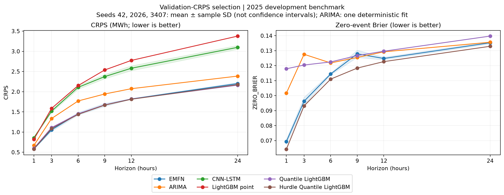

# 검증 CRPS 선택 통일 및 다중 시드 비교

> 2026-10-05 문서 정리: 아래는 완료된 6개 모델 실험의 전체 기록입니다. 현재 표준 모델 중심의 본문과 확률 비교 부록 배치는 [현재 구성안](baseline_benchmarks_and_future_plan.md)을 따릅니다. 배치 변경으로 실험 결과를 삭제하거나 소급 수정하지 않습니다.

실행 `crps_multiseed_20261004T175005+0900`. 당시 본문 후보였던 EMFN + 비교 모델 5개, 시계 [1, 3, 6, 9, 12, 24], 시드 [42, 2026, 3407]를 실행 전에 고정했습니다. 신규 **신경망 36개 + LightGBM 54개 학습**, 이미 검증 CRPS로 선택한 ARIMA의 6개 시계 결과 재사용으로 총 **96개 모델·시계·시드 조합**입니다. ARIMA의 선택 차수는 2종이며 반복 시드 학습을 하지 않았습니다. 검증/평가를 합쳐 192개 지표 행을 기록했습니다. 2025년은 과거에 참조한 개발 벤치마크입니다.

## 무엇을 통일했는가

- EMFN, CNN-LSTM의 매 epoch 체크포인트 선택과 조기 종료를 검증 CRPS 기준으로 바꿨습니다. EMFN의 ReduceLROnPlateau도 같은 검증 CRPS를 관찰합니다. 따라서 이전 결과와의 차이는 체크포인트 선택만 바꾼 효과로 분리할 수 없습니다. 학습 손실은 기존 Hurdle composite / Huber를 유지합니다.
- EMFN은 [0,21]의 1001점 CDF 적분, CNN-LSTM과 점예측 LightGBM은 [0,21] 클리핑 후 Dirac CRPS=MAE입니다. 선택에 사용하는 정답은 동일 원자료 정밀도이며 배치 크기에 따라 가중치가 달라지지 않습니다.
- LightGBM은 기존 후보 100/200회 중 전체 분포의 검증 CRPS가 가장 작은 설정을 선택합니다. 세 시드에서 각각 다시 적합하고 예측 차이를 확인했습니다. ARIMA는 이미 같은 기준으로 선택한 고정 모수를 해시 확인 후 재사용했습니다.
- 검증 자료로 재학습하거나 테스트 결과로 시드·모형·epoch를 선택하지 않았습니다. 3개 시드를 모두 보고합니다. 기존 결과 파일과 가중치는 보존했습니다.
- ARIMA censoring, 분위수 교차 정렬·끝점 보간, 허들 양수 조건부 분포의 구성은 [앞선 확장 실행](probabilistic_baselines.md)과 같습니다. 이번에 유리한 결과를 얻기 위해 분포 구성을 추가 튜닝하지 않았습니다.
- EMFN 최대 35 epoch/조기 종료 patience 7, CNN-LSTM 최대 25/patience 5, batch 128입니다. 학습 예산 자체가 동일한 것은 아닙니다. 모든 새 LightGBM과 두 신경망은 발전량+기상 6종의 24시간 입력이며 ARIMA는 발전량 과거 상태를 누적합니다.

## 결과: 시드 평균과 편차

먼저 각 시드에서 6개 시계 지표를 동일 가중 평균한 뒤, 그 값들의 평균 ± 표본 표준편차(ddof=1)를 계산했습니다. RMSE는 확률 모델의 평균, MAE는 중앙값을 사용합니다. 결정론 모델은 자체 점출력입니다. 시계별 RMSE 평균은 전체 표본을 합친 RMSE가 아닙니다.

| model | n_fits_per_horizon | crps | zero_brier | rmse | mae | zero_auprc |
| --- | --- | --- | --- | --- | --- | --- |
| EMFN | 3 | 1.4642 ± 0.0126 | 0.1113 ± 0.0005 | 3.1041 ± 0.0225 | 2.0467 ± 0.0195 | 0.4447 ± 0.0029 |
| ARIMA | 1 | 1.6967 | 0.1236 | 3.3729 | 2.3875 | 0.3996 |
| CNN-LSTM | 3 | 2.0896 ± 0.0267 | N/A | 3.2945 ± 0.0617 | 2.0896 ± 0.0268 | N/A |
| LightGBM point | 3 | 2.2086 ± 0.0000 | N/A | 3.0721 ± 0.0000 | 2.2086 ± 0.0000 | N/A |
| Quantile LightGBM | 3 | 1.4689 ± 0.0000 | 0.1262 ± 0.0000 | 3.1440 ± 0.0000 | 2.0168 ± 0.0000 | 0.3852 ± 0.0000 |
| Hurdle Quantile LightGBM | 3 | 1.4607 ± 0.0000 | 0.1071 ± 0.0000 | 3.1140 ± 0.0000 | 2.0156 ± 0.0000 | 0.4489 ± 0.0000 |

LightGBM 세 시드의 모든 저장 예측이 동일했는가: **예**. 현재 full-data/full-feature 설정에서 확인한 SD=0을 일반적인 안정성 우월성으로 해석하지 않습니다. ARIMA의 SD는 N/A이고 반복 적합한 것처럼 계산하지 않았습니다. GPU 신경망의 비트 단위 재현성은 보장하지 않습니다.

EMFN과 허들 분위수 LightGBM의 시계 평균 CRPS 차이(EMFN−LightGBM)는 **+0.0034 MWh**입니다. 허들 LightGBM의 평균 영발전 Brier가 더 낮은 시계는 **6/6개**입니다. 현재 결과로 EMFN의 전반적인 확률 예측 우월성을 주장하지 않습니다.

각 시계의 최저 평균 CRPS 모델(유의성 검정의 결론이 아님):

| horizon | lowest_mean_CRPS | crps |
| --- | --- | --- |
| +1h | EMFN | 0.5802 |
| +3h | EMFN | 1.0563 |
| +6h | Hurdle Quantile LightGBM | 1.4386 |
| +9h | Hurdle Quantile LightGBM | 1.6679 |
| +12h | Hurdle Quantile LightGBM | 1.8130 |
| +24h | Quantile LightGBM | 2.1628 |



## 짝지은 시간 블록 불확실성

각 타깃 시점에서 시드별 **손실**을 평균하고, 같은 타깃의 `EMFN − 비교 모델` 손실 차이를 구했습니다. 예측분포를 섞은 앙상블의 점수가 아닙니다. 음수는 EMFN에 유리하고 양수는 비교 모델에 유리합니다. 같은 시점들을 함께 재표집하는 circular block bootstrap 2,000회, 24시간/168시간 블록을 모두 제공합니다. 이 방식은 고정 길이 블록이 끝에서 처음으로 이어지는 [공식 CircularBlockBootstrap 정의](https://arch.readthedocs.io/en/latest/bootstrap/generated/arch.bootstrap.CircularBlockBootstrap.html)에 해당합니다.

허들 분위수 LightGBM 대비 168시간 블록의 95% percentile 구간:

| horizon_hours | metric | difference | lower_95 | upper_95 |
| --- | --- | --- | --- | --- |
| 1 | crps | -0.0011 | -0.0135 | 0.0110 |
| 1 | zero_brier | 0.0051 | 0.0031 | 0.0070 |
| 3 | crps | -0.0315 | -0.0575 | -0.0061 |
| 3 | zero_brier | 0.0031 | 0.0006 | 0.0055 |
| 6 | crps | 0.0142 | -0.0247 | 0.0602 |
| 6 | zero_brier | 0.0034 | -0.0004 | 0.0071 |
| 9 | crps | 0.0052 | -0.0371 | 0.0486 |
| 9 | zero_brier | 0.0095 | 0.0045 | 0.0146 |
| 12 | crps | 0.0076 | -0.0366 | 0.0528 |
| 12 | zero_brier | 0.0021 | -0.0013 | 0.0054 |
| 24 | crps | 0.0261 | -0.0226 | 0.0793 |
| 24 | zero_brier | 0.0024 | -0.0009 | 0.0059 |

허들 분위수 LightGBM 대비 CRPS 차이 구간의 상한이 24h와 168h 블록에서 모두 0보다 작은 시계는 **+3h**입니다. 이는 아래 제한을 가진 탐색적 결과이며, 전체 시계에 대한 우월성 주장으로 확대하지 않습니다.

이 구간은 고정된 세 학습 실행을 조건으로 한 평가 시계열 변동을 나타냅니다. 학습 시드 모집단 전체나 다른 연도·발전소에 대한 신뢰구간은 아닙니다. 3개 시드의 SD를 별도로 보고하는 이유입니다. 블록 길이는 일/주 시간 의존성의 민감도 진단이며 최적 길이를 입증하지 않았습니다. 비정상성·계절 변화·다중 비교 보정을 해결하지 않으므로 탐색적 구간으로 해석합니다. 0을 포함한다고 두 모델이 동등하다는 뜻은 아닙니다. 블록 길이에 따라 결론이 달라지면 안정적인 우위로 주장하지 않습니다.

CRPS와 Brier의 역할은 확정한 주/보조 지표를 유지합니다. 분포 평가의 이론적 근거는 [Gneiting & Raftery (2007)](https://sites.stat.washington.edu/people/raftery/Research/PDF/Gneiting2007jasa.pdf)를 참고하십시오. 결과가 유리한 지표로 주 지표를 바꾸지 않습니다.

## 검증·재현

- 32개 단위·통합 테스트 통과. 신규 검증에는 CRPS epoch 선택, 테스트 정답 변조 시 체크포인트 불변성, 배치 분할에 독립적인 CDF 적분, 블록 부트스트랩의 상수 차이·부호·부분 블록 처리 및 명시적 재표집과의 수치 일치가 포함됩니다.
- 192개 지표 행 재계산, 36개 신경망의 검증/평가 전체 예측 재로딩, 54개 LightGBM의 모든 저장 트리 표본 추론, ARIMA 6개 모수 추론을 확인했습니다. 기록된 후보 중 최소 검증 CRPS 선택, 동일 타깃·발행 시각·정답, 데이터·산출물·실행 소스 해시를 검증했습니다.
- 재로딩 검증의 첫 시도에서 별도 프로세스의 cuDNN TF32 기본값(True)이 학습 설정(False)과 달라 예측 차이가 났습니다. 학습과 같은 정밀도 설정을 적용하자 진단한 체크포인트의 차이가 정확히 0이 되었고, 전체 검증도 같은 설정으로 수행했습니다. 허용오차 완화나 재학습으로 처리하지 않았습니다.
- 고정된 매 10번째 평가 표본에서 CDF 격자를 1001점에서 2001점으로 늘린 평균 CRPS 차이의 최대값은 0.000397 MWh입니다. 이는 적분 민감도이며 분포 모형 가정의 정확도를 보장하지 않습니다.
- 실행 설정·학습 소스·가중치·검증/평가 예측·epoch 이력은 Git 제외 경로 `models/runs/crps_multiseed_20261004T175005+0900/`에 있습니다. 이후 추가한 분석 스크립트는 별도 analysis_source.zip과 해시로 보존합니다.
- 기존 `models/checkpoints/emfn_*.pt`는 덮어쓰지 않았습니다. 이번 결과를 재현할 때는 실행 manifest의 시드별 체크포인트 경로를 사용합니다.
- 원래 14개 모델 확장 비교와 구조 어블레이션은 과거 결과로 유지합니다. 이번 선택 기준 통일·다중 시드는 당시 선정한 6개 모델 범위이며 다른 신경망과 구조 변형 전체를 재실행한 것은 아닙니다. 현재 본문/보조 표는 `export_paper_views`로 이 검증된 요약에서 추출합니다.

이전 확장 실행과 같은 프로젝트 로컬 호환 환경을 사용합니다.

```powershell
$env:PYTHONPATH = Join-Path $PWD '.experiment_archive/python_runtime'
python -m unittest test_forecast_protocol test_probabilistic_extension test_crps_selection test_paired_uncertainty -v
python -m src.experiments.run_multiseed_crps
python -m src.experiments.analyze_multiseed_crps
python -m src.experiments.report_multiseed_crps
```

중단한 학습은 설정·실행 소스가 같을 때 `python -m src.experiments.run_multiseed_crps --resume models/runs/<run_id>`로 완료된 조합을 보존하며 이어갈 수 있습니다. 새 실행은 별도 run을 생성하고 완료 후 다중 시드 보고용 파일만 게시합니다.

[시계별 평균·SD](tables/multiseed_crps_summary.csv) · [시드별 검증/평가 지표](tables/multiseed_crps_metrics.csv) · [24h/168h 짝지은 구간](tables/multiseed_crps_paired_intervals.csv) · [선택 epoch/학습 횟수](tables/multiseed_crps_selection.csv) · [검증 결과](multiseed_crps_validation.json)
