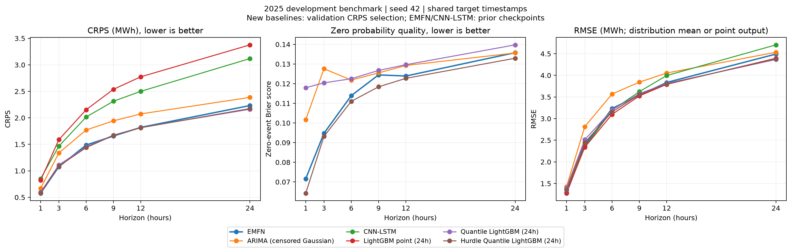

# ARIMA 및 확률 LightGBM 초기 비교

2026-10-04. 실행 `probabilistic_extension_20261004T121114+0900`. 기존 LightGBM(+Weather)와 CNN-LSTM(+Weather)을 포함한 10개 모델은 삭제하지 않았습니다. 새 모델 4종 × 6개 시계를 추가하여 **총 14개 모델 × 6개 시계 = 84개 평가 행**을 저장했습니다. 새 모델은 ARIMA, 24h 점예측 LightGBM, 24h 분위수 LightGBM, 24h 허들 분위수 LightGBM입니다.

> 2026-10-05 문서 정리: 아래 모델 목록은 단일 시드 확장 당시의 구성안입니다. 최신 실험은 [다중 시드 보고서](multiseed_crps_results.md), 현재 본문/부록 배치는 [연구 계획](baseline_benchmarks_and_future_plan.md)을 참고하십시오. `paper_five_comparators.csv`는 이전 단계의 축약 표이며 최신 본문 표가 아닙니다.

## 확장 당시 본문 비교 모델 5개 구성안

여기서 최대 5개는 **EMFN을 제외한 비교 모델 수**로 해석했습니다. 당시 후보 표는 제안 모델을 포함해 6개 모델입니다. 이 구성은 해당 확장 실행의 새 2025년 결과를 확인하기 전에 방법별 역할을 기준으로 설정 파일에 기록했습니다. 이후 편집 구성 변경을 이 실험의 사전 결정으로 소급하지 않습니다.

| 비교 모델 | 역할 |
|---|---|
| ARIMA | 고전 선형 시계열 및 가우시안 예측분포 기준 |
| CNN-LSTM (+Weather) | 신경망 결합 구조 기준 |
| LightGBM (24h matched) | 동일 입력 예산의 트리 점예측 기준 |
| Quantile LightGBM (24h matched) | 직접 분위수 예측 기준 |
| Hurdle Quantile LightGBM (24h matched) | 영발전 분류와 양수 조건부 분포를 결합한 기준 |

기존 168h lag·달력 특징 LightGBM은 전체 비교표에 유지합니다. 본문에서는 EMFN과 같은 원자료 채널·24시간 입력을 사용하는 LightGBM을 제시합니다. Persistence, LSTM, TCN, DLinear, Transformer, GRU 등 기존 비교는 부록용 전체 표에 남깁니다. GRU의 기존 상수 예측 실패 표기도 유지합니다.

## 결과

주 지표 CRPS의 시계별 값(MWh, 낮을수록 좋음):

| horizon | EMFN | ARIMA (censored Gaussian) | CNN-LSTM | LightGBM point (24h) | Quantile LightGBM (24h) | Hurdle Quantile LightGBM (24h) |
| --- | --- | --- | --- | --- | --- | --- |
| +1h | 0.5775 | 0.6689 | 0.8507 | 0.8209 | 0.5960 | 0.5813 |
| +3h | 1.0773 | 1.3362 | 1.4640 | 1.5873 | 1.1104 | 1.0878 |
| +6h | 1.4869 | 1.7710 | 2.0158 | 2.1528 | 1.4523 | 1.4386 |
| +9h | 1.6570 | 1.9433 | 2.3131 | 2.5385 | 1.6739 | 1.6679 |
| +12h | 1.8204 | 2.0745 | 2.5007 | 2.7746 | 1.8178 | 1.8130 |
| +24h | 2.2323 | 2.3865 | 3.1187 | 3.3772 | 2.1628 | 2.1758 |

6개 시계별 지표의 동일 가중 산술평균:

| model | crps | zero_brier | rmse | mae | zero_auprc |
| --- | --- | --- | --- | --- | --- |
| EMFN | 1.4752 | 0.1107 | 3.1267 | 2.0695 | 0.4486 |
| ARIMA (censored Gaussian) | 1.6967 | 0.1236 | 3.3729 | 2.3875 | 0.3996 |
| CNN-LSTM | 2.0438 | N/A | 3.2040 | 2.0438 | N/A |
| LightGBM point (24h) | 2.2086 | N/A | 3.0721 | 2.2086 | N/A |
| Quantile LightGBM (24h) | 1.4689 | 0.1262 | 3.1440 | 2.0168 | 0.3852 |
| Hurdle Quantile LightGBM (24h) | 1.4607 | 0.1071 | 3.1140 | 2.0156 | 0.4489 |

이 표의 MAE는 확률 모델의 중앙값, RMSE는 예측분포의 평균을 사용합니다. 결정론 모델은 자체 점예측을 사용합니다. Brier/AUPRC가 N/A인 모델에는 영발전 확률 출력을 임의로 만들지 않았습니다. 시계별 RMSE의 평균은 표본을 합친 전체 RMSE와 다릅니다.

EMFN은 +1h/+3h/+9h CRPS에서 이 비교군 중 가장 낮습니다. 허들 분위수 LightGBM은 +6h/+12h, 직접 분위수 LightGBM은 +24h에서 가장 낮습니다. 허들 분위수 LightGBM은 EMFN보다 영발전 Brier score가 6개 시계 모두 낮습니다. 이는 단일 시드·단일 개발 기간의 관찰이며 통계적 유의성을 입증하지 않았습니다. 평균 CRPS 차이가 작으므로 다중 시드와 시간 블록별 paired 검증이 필요합니다.



## 학습·선택·정보 가용성

- 원본 학습/검증/2025 평가 분할과 처리 데이터 해시는 기존 수정 실행과 같습니다. 2025는 이미 참조한 개발 벤치마크이며 블라인드 검증이 아닙니다.
- ARIMA의 후보 차수는 [[1, 0, 0], [2, 0, 1], [3, 0, 2], [1, 1, 0], [1, 1, 1]]이고 모두 수렴했습니다. 학습 구간에서만 모수를 적합하고, 시계별 검증 CRPS로 선택했습니다. +1h/+3h는 (1,1,1), 나머지는 (1,0,0)이 선택됐습니다. 관측을 매 발행 시점까지 필터링해 상태를 갱신하며, 미래값을 이용한 smoothing은 사용하지 않습니다. 검증 구간으로 모수를 재적합하지 않습니다.
- 추가 LightGBM은 발전량+기상 6종의 24시간 윈도우를 168개 특징으로 펼칩니다. 달력 특징과 48/168시간 lag는 없습니다. 기상 표준화는 학습 구간에만 적합합니다.
- tree leaves=15, learning rate=0.05, min_data_in_leaf=40, 후보 학습 횟수 100/200, seed=42를 실행 전에 고정했습니다. 직접 분위수 모델은 모든 학습 타깃에, 허들 모델의 조건부 분위수는 양수 타깃에만 적합합니다. 허들 분류기는 전체 학습 타깃의 양수 여부를 학습합니다.
- 각 확률 모델의 분위수·분류기를 묶은 전체 예측분포의 **검증 CRPS**로 학습 횟수를 선택합니다. 개별 분위수별로 다른 횟수를 고르지 않습니다. 점예측 모델은 Dirac CRPS=MAE로 선택합니다. 모든 선택 후보 값은 `tables/probabilistic_validation_candidates.csv`에 남겼습니다.
- EMFN과 CNN-LSTM을 포함한 기존 모델은 기존 체크포인트를 재사용했습니다. 이들의 체크포인트 선택은 기존 validation loss 기준입니다. **모든 모델을 검증 CRPS로 다시 선택한 최종 비교는 아직 아닙니다.** 신규 모델의 제한된 후보 탐색과 기존 모델의 학습 예산도 같지 않습니다.
- ARIMA는 발전량만 사용하고 필터 상태에 과거 정보를 누적하므로, 24시간만 사용하는 모델과 정보 구조가 다릅니다. 동일한 타깃/발행 시점에서 비교하는 통계 기준선으로 해석합니다.

## 예측분포 구성

**ARIMA:** 원래 가우시안 예측을 [0,21]로 censor/winsorize한 분포입니다. 이는 구간 안으로 조건화하는 truncated Gaussian과 다릅니다. 0 이하 확률은 0의 질량으로, 21 이상 확률은 21의 질량으로 이동합니다. 0 확률·평균·중앙값·구간을 그 분포에서 계산합니다. 평균은 단순히 raw 평균을 clip한 값과 다를 수 있습니다. 원래 가우시안 평균과 표준편차도 보존합니다.

**직접 분위수 LightGBM:** 21개 분위수(0.01, 0.05 간격의 0.05~0.95, 0.99)를 각각 학습합니다. 교차 분위수를 정렬하고 [0,21]로 제한한 뒤 (tau=0,value=0), (tau=1,value=21) 끝점을 붙여 분위수 함수를 선형 보간합니다. 0으로 제한된 평탄부가 있으면 해당 분포에 0의 질량이 생기며 이를 Brier 평가에 사용합니다. 독립 분류기로 추정한 영발전 확률은 아닙니다. 희소 분위수·끝점 보간 가정의 민감도는 후속 검토 대상입니다.

**허들 분위수 LightGBM:** 이진 분류기의 p_zero와 양수 조건부 분위수 함수를 결합합니다. 조건부 내부 분위수의 최솟값 1e-6 MWh는 수치적 바닥값이며 관측 영발전 라벨을 바꾸는 임계값이 아닙니다. 평균은 (1-p_zero)×조건부 평균이고, 중앙값·구간은 혼합분포에서 계산합니다.

추가 확률 모델의 RMSE는 위 최종 분포의 평균, MAE는 중앙값입니다. 범위 제약이 사후에 적용된 모델을 EMFN처럼 자체 유계 구조라고 주장하지 않습니다. raw 물리 위반율은 원래 평균 점예측 기준이며 raw 분위수의 범위 위반은 별도 `probabilistic_output_diagnostics.csv`에 있습니다.

모든 확률 모델의 CRPS는 [0,21]의 같은 1001점 CDF 격자에서 계산합니다. 결정론 모델의 Dirac CRPS는 정확한 절대오차로 계산합니다. 고정 간격으로 뽑은 표본에서 2001점으로 세분화했을 때 평균 CRPS 차이의 최댓값은 0.000397 MWh였습니다. 이는 수치 적분 민감도 점검이며 분위수 모델 자체의 분포 근사 오차를 검증한 것은 아닙니다.

PICP는 원자 질량을 포함한 구간의 포함률이므로 명목 90%와 정확히 일치해야만 보정이 좋은 것은 아닙니다. 구간 폭과 점질량을 고려한 보정 진단을 함께 봐야 합니다.

## 검증 및 보존

- 기존 13개+추가 10개 = 총 23개 테스트 통과: 차분/MA를 포함한 ARIMA의 표준 statsmodels 예측 일치, 미래값 변조 불변성, 누락 시각 보존, 저장 모수 재로딩, 분위수 교차/점질량/혼합 평균·중앙값, LightGBM 저장·재로딩 등.
- 84개 평가 행의 동일 타깃·발행 시각·정답 및 지표 재계산 확인, 추가 모델 24개 조합의 모수/트리 재로딩 확인.
- 기존 공통 평가 표본 수(8736/8734/8731/8728/8725/8713)를 그대로 유지합니다. 실패한 구현 검증 실행은 별도 로컬 run에 실패 사유를 남겼습니다.
- 실행 소스 ZIP, 데이터 해시, 모델 파일·예측 parquet 해시, 후보 선택 기록, 라이브러리 버전은 `probabilistic_run_manifest.json`에 연결되어 있습니다. 모델·예측 본체는 Git 제외된 `models/runs/`에 있습니다.
- 이전에 누락된 구 문서/그림 아카이브 디렉터리도 이제 `.gitignore`에 포함했습니다. `pre_correction_manifest.json`은 추적 대상으로 유지합니다. 커밋·푸시는 수행하지 않았습니다.

## 재현 환경과 명령

기존 Windows 환경의 NumPy 2.4.6 / SciPy 1.17.1 조합에서 statsmodels 상태공간 계산이 프로세스를 종료했습니다. statsmodels만 교체해도 재현되어, **프로젝트 로컬**에 NumPy 2.2.6 / SciPy 1.15.3 / statsmodels 0.14.6을 분리 설치했습니다. 기존 conda 환경의 패키지는 변경하지 않았습니다. 정확한 원인 DLL까지 특정한 것은 아닙니다.

기본 프로젝트 의존성이 설치된 Windows PowerShell에서:

```powershell
python -m pip install --no-deps --target .experiment_archive/python_runtime -r requirements_probabilistic.txt
$env:PYTHONPATH = Join-Path $PWD '.experiment_archive/python_runtime'
python -m unittest test_forecast_protocol test_probabilistic_extension -v
python -m src.experiments.run_probabilistic_benchmarks
python -m src.experiments.verify_probabilistic_artifacts
python -m src.experiments.summarize_probabilistic_benchmarks
```

새 실행은 별도 run을 만들고 확장 비교표를 갱신합니다. 기존 `comprehensive_extended_metric_matrix.csv` 및 수정 전 실험은 보존합니다. 일반 프로젝트 환경으로 돌아갈 때는 해당 PowerShell 세션의 PYTHONPATH 설정을 해제하면 됩니다.

[본문용 시계별 5개 지표 표](tables/paper_five_comparators.csv) · [14개 모델 전체 표](tables/probabilistic_extended_benchmark.csv) · [검증 결과](probabilistic_artifact_validation.json)
